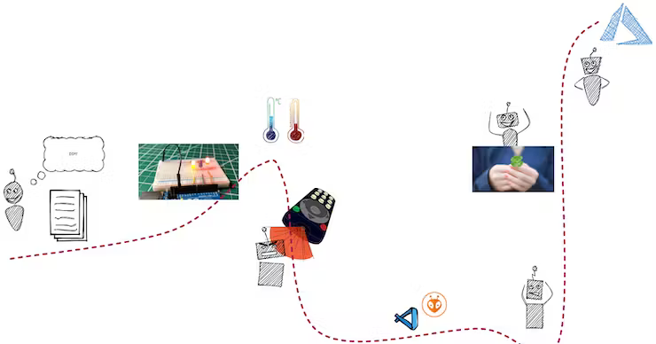
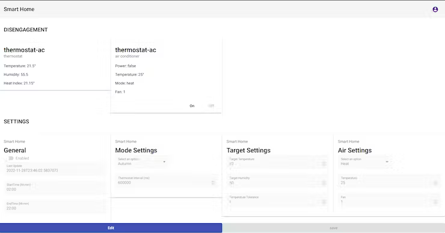
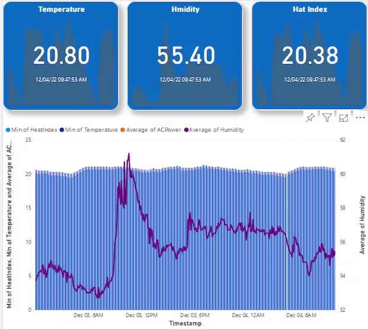

The goal of the project is to control the air conditioner from the internet and in an automatic way.

## Things used in this project

### Hardware components

- [ESP32 NODEMCU](https://www.az-delivery.de/it/products/esp32-developmentboard)
- [Adafruit DHT22 temperature-humidity sensor](https://www.adafruit.com/product/385)
- [IR transmitter (generic)](https://www.amazon.it/LAOMAO-diodi-infrarossi-emissione-ricezione/dp/B00EFOTJZE/ref=sr_1_11?keywords=trasmettitore+ir&qid=1703090679&sr=8-11)
- [General Purpose Transistor NPN](https://www.amazon.it/POPESQ%C2%AE-BC547-Transistor-pcs-A715/dp/B07DR8VGZ7/ref=sr_1_12?__mk_it_IT=%C3%85M%C3%85%C5%BD%C3%95%C3%91&crid=1LFNDETT0HK4G&keywords=transistor&qid=1703090698&sprefix=transistor%2Caps%2C136&sr=8-12)

### Software apps and online services

- [circuito.io](https://www.circuito.io/)
- [VS Code](https://code.visualstudio.com/)
- [Microsoft Azure](https://portal.azure.com/#home)

### Code

- [Github - My Smart Home - IoT Hub](https://github.com/samuele-cozzi/my-smarthome-iothub)
- [Github - My Smart Home - function](https://github.com/samuele-cozzi/my-smarthome-func)
- [Github - My Smart Home - ui](https://github.com/samuele-cozzi/my-smarthome-ui)

## Abstract

The project consists in building an IoT system in the house connected to the cloud. The goal of the project is to control with infrared signals the air conditioner from the mobile website or in an automatic way. It is the first step in building my smart home hub on Azure.

## My project journey

I started with the idea of building my first project with IoT. I have bought my first Arduino starter kit. Following some online guide, I was able to blink a led light and write on the console the temperature and humidity.

I'm a lazy person. In my house, I have an air conditioner (SEZ KD50 VAL + PAR-FA32MA) commanded by a remote controller (PAR-FL32MA), with IR signals. I don't want to stand up every time I need to turn on or switch off the air conditioner, so I have an idea for my first project in IoT.

Years passed so I need a deadline, to develop a plan for the project delivery. In Europe, the cost of energy increased because of the war. So autumn was the natural deadline. So I have tried to control my air conditioner with infrared signals. And the problems begin.

Some time has passed, and I have changed the board (ESP32), developer tools, code and everything else. At a lucky moment, I found the correct configuration of IRModule for my Mitsubishi air conditioner, and everything else was in descend.



## Hardware Build

My air conditioner is Mitsubishi SEZ KD50 VAL with:

- The PAR-FL32MA Remote Controller is an infrared remote controller compatible with all our air conditioning units.
- The PAR-FA32MA Remote Controller - Wireless Receiver connects to the PAR-FL32MA infrared remote controller.

I have begun with Arduino UNO board, but I have turned to ESP32 board because:

- Network connectivity to integrate Cloud provider
- IRRemote library not available for Arduino board

The final hardware configuration will show in the picture (for details see schematics section):


During the project, I have used also an IR receiver and the camera of a smartphone to test the IR transmitter.

The circuit is alimented in 5V.

I have used DHT11 to reveal temperature, humidity and heat index, but the accuracy is not acceptable to automatize my home. I bought DHT22 to increase accuracy without changing the configuration, and the accuracy was acceptable.

- Low cost
- 3 to 5V power and I/O
- 2.5mA max current use during conversion (while requesting data)
- Good for 0-100% humidity readings with 2-5% accuracy
- Good for -40 to 80°C temperature readings ±0.5°C accuracy
- No more than 0.5 Hz sampling rate (once every 2 seconds)
- Body size 15.1mm x 25mm x 7.7mm
- 4 pins with 0.1" spacing

The Hardest part is the IR remote controller. Take me a lot of time to understand infrared messages and the commercial codification of Mitsubishi. I had a lot of luck making it works, but only with the IRRemote library.

## Software Build

The ESP32 implements a temperature controller and an infrared transmitter. The objective of this software project is to place the algorithms that control the "things" in the cloud, and not on the edge.

The board implements:

- Connect the ESP32 board to the WIFI.
- Acquire time data from a server on the internet to synchronize the internal ESP32 clock with this internet server to get an official time.
- Acquire temperature and humidity data serially from the DHT22 sensor via a one-wire interface and send data to the cloud
- Listen from the cloud the messages and send signals to the infrared transmitter to control the air conditioner

Prerequisites:

- Visual Studio Code
- c/c++ plugin
- PlatformIO IDE plugin

Board extensions (platformio.ini):

```
[env:featheresp32]
platform = espressif32
board = featheresp32
framework = arduino
lib_deps =
    crankyoldgit/IRremoteESP8266@^2.8.2
    bblanchon/ArduinoJson@^6.19.4
    adafruit/Adafruit Unified Sensor@^1.1.5
    adafruit/DHT sensor library@^1.4.4
    azure/Azure SDK for C@1.0.0-beta.5
monitor_speed = 115200
```

Libraries:

- crankyoldgit/IRremoteESP8266: Infrared remote library for ESP8266/ESP32: send and receive infrared signals with multiple protocols. Based on: https://github.com/shirriff/Arduino-IRremote/
- adafruit/DHT-sensor-library: Arduino library for DHT11, DHT22, etc Temperature & Humidity Sensors
- Azure/azure-sdk-for-c: This repository is for active development of the Azure SDK for Embedded C. For consumers of the SDK we recommend visiting our versioned developer docs at https://azure.github.io/azure-sdk-for-c.

## Cloud Build

The algorithms to control the smart home (at the moment the air conditioner) are remote and were built in the cloud.

The building blocks to architect the solution are:

- IoT Hub | Microsoft Azure
- Azure Blob Storage | Microsoft Azure
- Azure Functions – Serverless Functions in Computing | Microsoft Azure
- Azure Static Web Apps – App Service | Microsoft Azure
- Data Visualisation | Microsoft Power BI

In the picture the cloud architecture diagram shows how the building blocks are connected:


The architecture has followed the principles:

- minimize cost
- extensibility and scalability
- serverless and PaaS over control

The code lives on GitHub. The repository has implemented continuous delivery through the GitHub action:

- The IaaC (infrastructure as a code) implementation.
- The functions and static website will be deployed upon any changes.

The azure functions are the core of the system. I have built two triggered functions

**Event hub Trigger**

The function listen to the events of the IoT hub, read data of the house, save them into storage (online and archive), and send them to power bi to visualize

**Time trigger function**

The function read temperature and humidity, and the status of the air conditioner from storage applies an algorithm to decide if turn on or off the air conditioner, and sends the signal to the IoT hub of the smart home

The static web app is a web application to set up the system, visualize real-time data, and control the air conditioner from remote control



In the power bi platform, the historic data are stored. A report is built to show data (temperature and humidity) over time.

