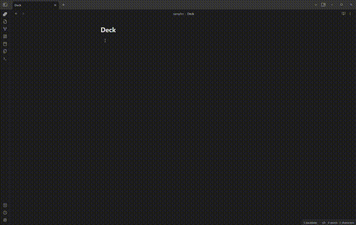
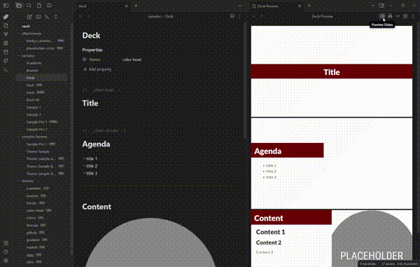

In the ever-evolving landscape of note-taking and presentation tools, enthusiasts are always on the lookout for innovative solutions that seamlessly integrate into their workflow. Enter Obsidian and Marp - an extraordinary power duo that transforms the way we present and share our notes.

## Obsidian: Your Personal Knowledge Hub in Markdown

[Obsidian](https://obsidian.md/) doesn't need a presentation. It is a powerful knowledge management and note-taking application that emphasizes the interconnectedness of ideas. It uses a markdown-based approach to capture and organize your thoughts, creating a network of knowledge that grows with your intellectual journey.

## Why Markdown for Personal Knowledge Management?

Using [Markdown](https://www.markdownguide.org/) for personal knowledge management offers several advantages that contribute to a more streamlined, efficient, and flexible approach to organizing and presenting information. Here are some compelling reasons to embrace Markdown in your knowledge management workflow:

1. **Simplicity and Readability:** Markdown's plain text and simple formatting syntax prioritize content over complex formatting, making it easy to read and write.

2. **Interconnected Notes:** Markdown-based tools support bidirectional linking, enabling the creation of a web of interconnected ideas for a deeper understanding of your knowledge base.

3. **Platform-Agnostic and Portable:** Markdown's compatibility across platforms and easy exportability to various formats ensure accessibility and portability, allowing you to seamlessly integrate your notes into different contexts.

## Marp: Transforming Your Markdown Notes into Engaging Presentations

### What is Marp?

[Marp](https://marp.app/) is an open-source markdown presentation tool that empowers users to create stunning slideshows using simple markdown syntax. With a minimalist design and a focus on functionality, Marp enables users to craft visually appealing presentations without the hassle of complex formatting.

### Key Features of Marp:

1. **Markdown Magic:** Write your presentations in markdown, a lightweight and easy-to-learn markup language. Marp transforms your plain text into beautiful, formatted slides effortlessly.

2. **Custom Themes:** Tailor your presentations to match your style with customizable themes. Whether you prefer a professional look or something more creative, Marp has you covered.

3. **Live Preview:** Witness your presentation come to life in real-time with Marp's live preview feature. Instantly see how your content will look during your presentation.

4. **Export Options:** Marp allows you to export your presentations in various formats, including PDF, HTML, and more. This versatility ensures compatibility with different platforms and devices.

## The Power Duo: Marp + Obsidian

The magic happens when Obsidian and Marp join forces. Users can effortlessly turn their well-organized Obsidian notes into captivating Marp presentations, providing a streamlined process for transforming ideas into impactful presentations.

The synergy between Marp and Obsidian creates a holistic workflow for individuals who value both the creation and presentation aspects of knowledge sharing. The fluid transition from note-taking to presentation design enhances productivity and creativity.

By combining the strengths of Marp and Obsidian, users can elevate their presentations to new heights. The clarity of thought facilitated by Obsidian seamlessly transitions into the visually compelling narratives crafted by Marp, resulting in presentations that captivate and resonate with audiences.

### Getting Started:

The prerequisites are to have Obsidian installed and to have set up a vault.

1. **Install Marp Slide Obsidian Plugin:** Begin by installing [Marp Slides](https://github.com/samuele-cozzi/obsidian-marp-slides) Obsidian Plugin and exploring [getting started](https://samuele-cozzi.github.io/obsidian-marp-slides/10.GettingStarted.html) and [features](https://samuele-cozzi.github.io/obsidian-marp-slides/20.Features.html) documentation.

2. **Familiarize with Marp syntax:** take some time to familiarize yourself with [Marp syntax](https://marpit.marp.app/markdown)

3. **Try sample vault:** Download from Github this [sample obsidian vault](https://github.com/samuele-cozzi/obsidian-marp-slides/tree/main/vault), and start to modify the sample decks

4. **Craft Your Presentation:** Use Marp's intuitive interface to customize themes, add visuals, and fine-tune your content. Leverage the live preview feature to see your presentation come to life.

5. **Present with Confidence:** Armed with your seamlessly integrated Marp and Obsidian presentation, step into the spotlight and share your ideas with confidence.

## For further insight

- [Marp Slides Obsidian Plugin](https://github.com/samuele-cozzi/obsidian-marp-slides)
- [Marp - Create Presentations with Markdown - DEV Community](https://dev.to/chris_ayers/marp-create-presentations-with-markdown-5e6k)
- [Bye-bye PowerPoint. Hello Marp!. Could this free Markdown-based tool… | by Dario Radečić | Towards Data Science](https://towardsdatascience.com/bye-bye-powerpoint-hello-marp-3c0e3b3198b1)