

 Marp

 VSCode Plugin

 Obsidian Plugin



---

In this blog post, we will delve into the features that set my Marp template apart, exploring how it seamlessly blends aesthetics with functionality to elevate your presentations to new heights. Whether you're aiming for a sleek corporate pitch, an engaging educational session, or a visually stunning project update, our template is your go-to resource for creating a lasting impression.

Let's embark on a visual voyage that transforms the way you share ideas and captivates your audience from the very first slide.

## Opening Slides

### Title Slide

A title template serves as the initial point of engagement, setting the tone for the entire presentation. It is the first impression that captures the audience's attention and provides a glimpse into the theme or message to follow. A well-designed title template not only conveys professionalism but also reflects the essence of the content. It incorporates key elements such as the presentation title, subtitle, and presenter information, presenting them in a visually appealing and cohesive manner.

The title slide has the `lead` class. The title can fit the width of the slide with the `<!--fit-->` code prepended

```markdown

--- 
<!-- _class: lead -->

# <!-- fit --> Title of Deck

## <!-- fit --> Subtitle Subtitle Subtitle Subtitle Subtitle 

**Author**
Milan, Marp Demo
YYYY/MM/DD

---
```

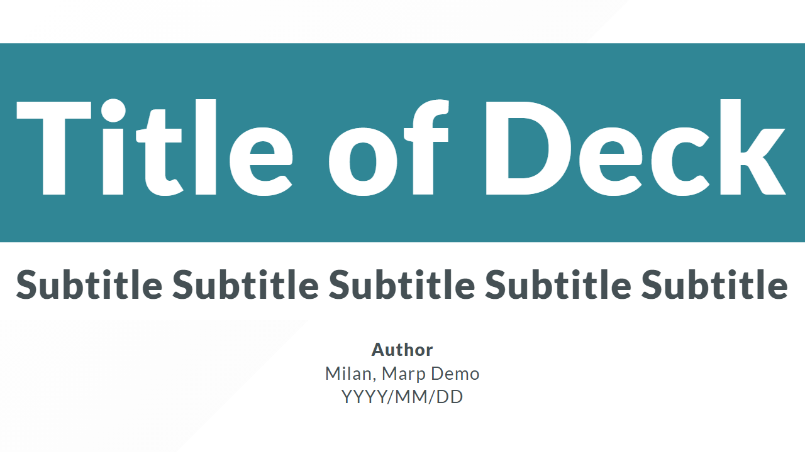

### Agenda

The agenda slide template acts as the roadmap for your presentation, providing a clear and organized overview of the topics to be covered, guiding your audience through the journey of information with a structured and professional touch.

The title slide has the `divider` class.

```markdown

--- 
<!-- _class: divider -->

## Agenda 

1. text
1. text
1. text
1. text

---
```

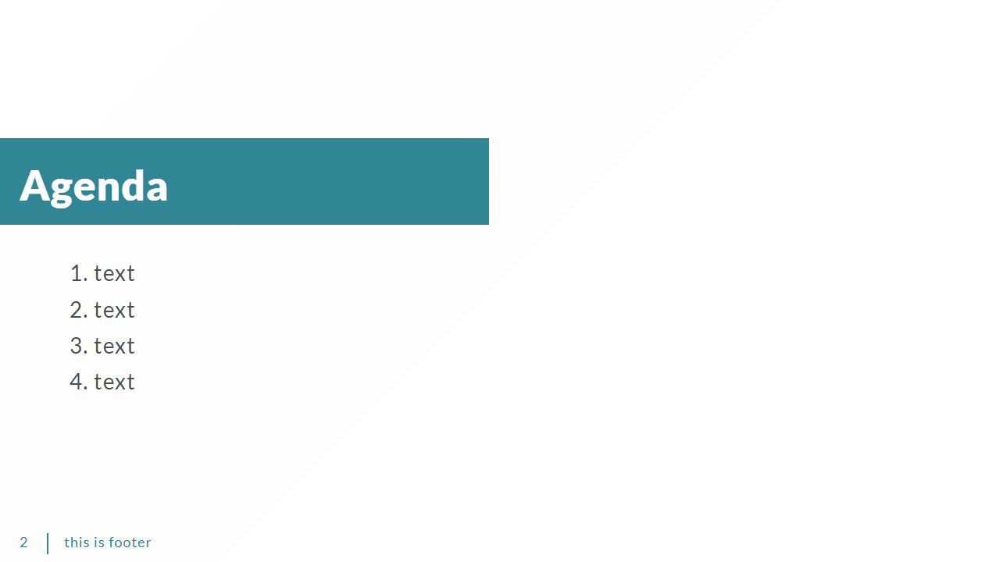

### Section Title

The section divider slide template serves as a visual break in a presentation, introducing a new section with clarity and emphasis. By incorporating a designated class attribute, such as `divider` the template allows for consistent styling or formatting rules to be applied, maintaining a cohesive and professional look throughout the presentation. This deliberate visual cue not only enhances the overall structure of the content but also aids the audience in understanding the transition between different segments of the presentation. The section divider slide acts as a seamless guide, contributing to a more organized and engaging presentation experience.

```markdown

--- 
<!-- _class:  divider -->

## Section Header

Section Details

---
```

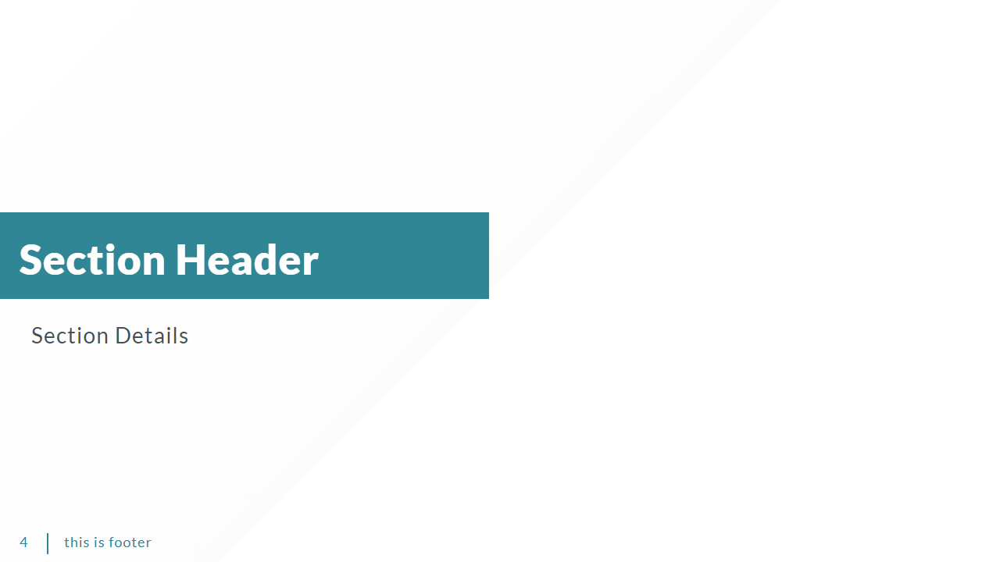

## Content Slides

The content slide template is the heart of a presentation, where information takes center stage in a structured and visually appealing manner.

### Text Slides

The text slide template provides a clean and focused canvas for conveying textual information in a presentation.

```markdown

--- 
## Content

### Subsection 1

#### Subsection 2

##### Subsection 3

###### Subsection 4

Text

---
```

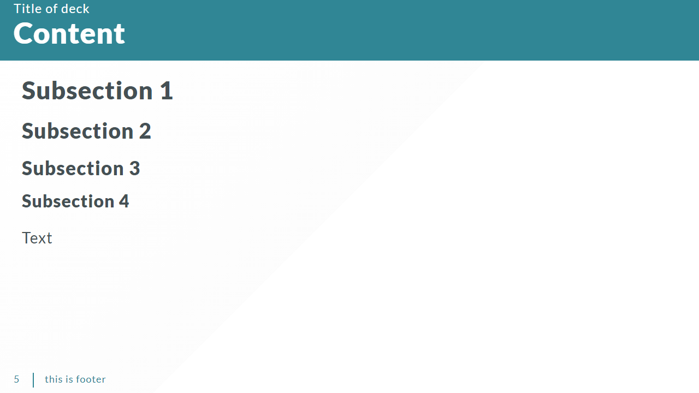

### Text and Picture Slide

The text and picture slide template seamlessly blends the power of words with visual impact, creating a harmonious presentation of information.

```markdown

--- 
## Two Columns Image

### column 1

text


---
```

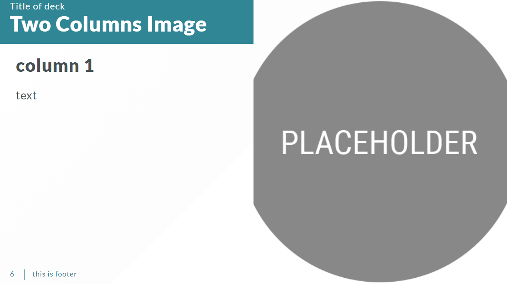

### Picture Slide

The picture slide template is the visual that places emphasis with a minimalist design, it provides a clean canvas to showcase a single, impactful image. The picture slide template transforms presentations into visually stunning experiences, leaving a lasting impression on the audience and reinforcing the idea that sometimes, an image is all it takes to convey a powerful.

```markdown

--- 
<!-- _class: center -->
## Picture 


---
```

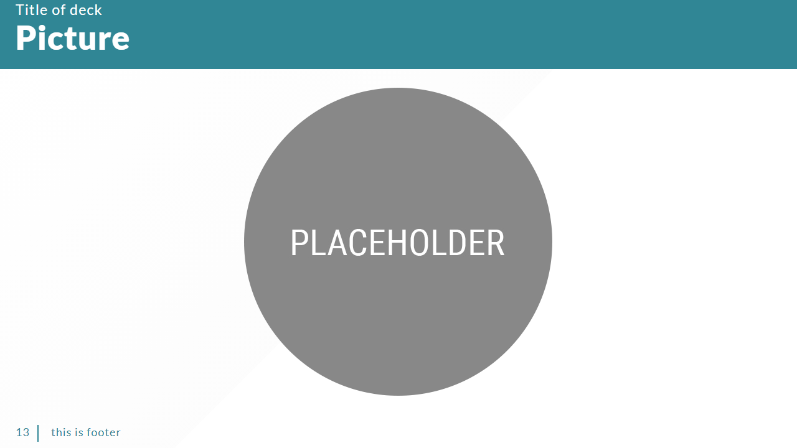

### Table Slide

The table slide template is a practical and efficient tool for presenting organized data in a structured format.  Whether used for financial reports, project timelines, or any tabular data, the table slide template brings a professional and organized look to the presentation, enabling the audience to grasp intricate details effortlessly.

```markdown

--- 
## Table

| text | text | text | text |
|---|---|---|---|
| text | text | text | text |
| text | text | text | text |
| text | text | text | text |

---
```

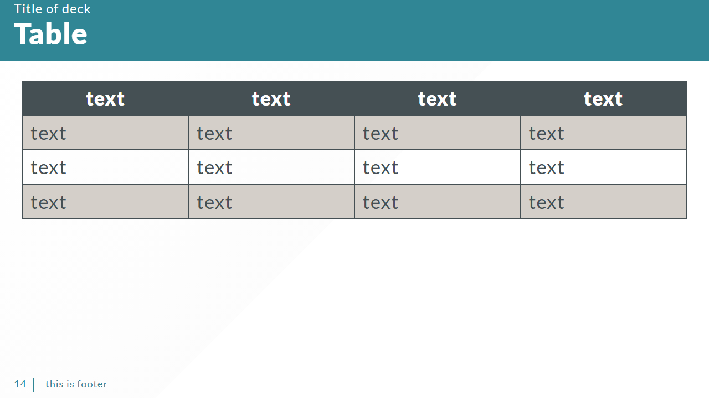

### Quote Slide

The quota slide template serves as a focused space to highlight key quotes or impactful statements, adding a touch of eloquence and emphasis to a presentation. The emphasis on a singular quote allows for a compelling visual and textual impact, making it a powerful tool for reinforcing key messages and leaving a lasting impression on the audience.

```markdown

--- 
<!-- _class: divider-->


> Quote of the day

---
```

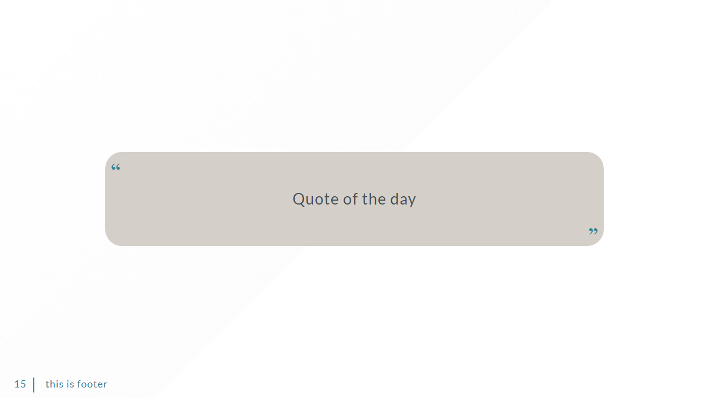

### Code Slide

The code slide template is a dedicated space for presenting programming code, offering a clean and organized layout tailored to the unique needs of technical presentations. Its structured design allows presenters to convey complex coding concepts with clarity, making it an essential tool for tech-savvy audiences and ensuring an effective communication of technical information.

```markdown

--- 
<!-- _footer: '' -->
<!-- _paginate: false -->

## Autoscaling Code

    ```
    bool getBit(int num, int i) {
        return ((num & (1<<i)) != 0);
    }

    bool getBit(int num, int i) {
        return ((num & (1<<i)) != 0) + ((num & (1<<i)) != 0) + ((num & (1<<i)) != 0) + ((num & (1<<i)) != 0) + ((num & (1<<i)) != 0);
    }

    bool getBit(int num, int i) {
        int i = 0;
        int i = 0;
        int i = 0;
        int i = 0;
        int i = 0;
        int i = 0;
        int i = 0;
        int i = 0;
        int i = 0;
        int i = 0;int i = 0;
        int i = 0;
        int i = 0;int i = 0;

        int i = 0;
        int i = 0;
        int i = 0;
        int i = 0;
        int i = 0;
        int i = 0;
        int i = 0;
        int i = 0;
        int i = 0;
        int i = 0;int i = 0;
        int i = 0;
        int i = 0;int i = 0;

        return ((num & (1<<i)) != 0);
        popo
  
    }
    ```

---
```

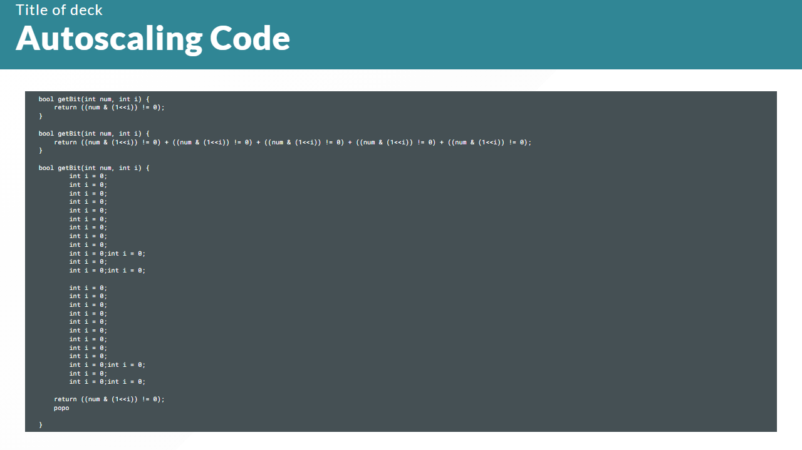

### Math Slide

The LaTeX math slide template provides a specialized and elegant space for incorporating mathematical expressions into a presentation. The LaTeX math slide template is an ideal choice for technical presentations where mathematical accuracy and professional formatting are paramount.

```markdown

--- 
## Math

Text text .....:

$$ I_{xx}=\int\int_Ry^2f(x,y)\cdot{}dydx $$

Text text .....:

$$
f(x) = \int_{-\infty}^\infty
    \hat f(\xi)\,e^{2 \pi i \xi x}
    \,d\xi
$$

Conclusion

---
```

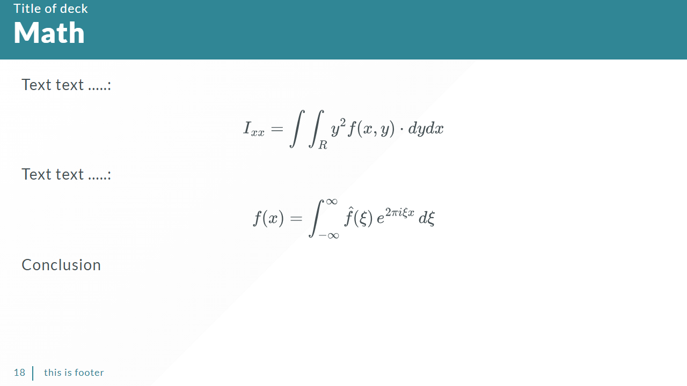

## Closing Slide

The closing slide template serves as the final touchpoint in a presentation, leaving a lasting impression on the audience. With a thoughtful design that may include a thank-you message, contact information, or a call to action, this template provides a professional and memorable conclusion to your presentation. Its purpose is to leave the audience with key takeaways, encourage further engagement, and express gratitude for their time and attention. The closing slide template is the perfect opportunity to leave a positive and lasting impression, ensuring that your presentation concludes on a high note.

```markdown

--- 
<!-- _class: divider -->

## Thank You

Author
mail@email.com
www.author.com
@Twitter

---
```

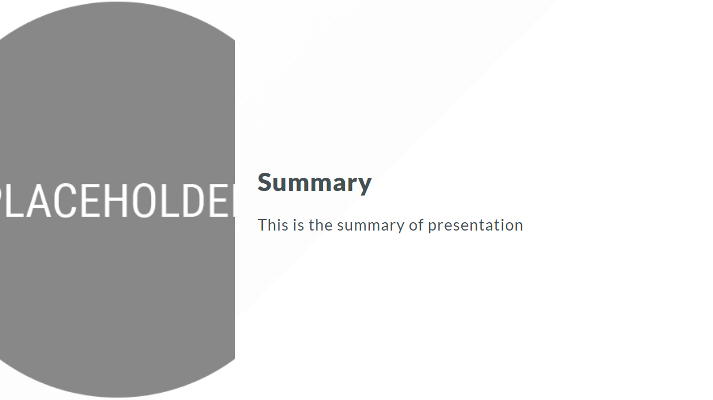

## Conclusion

This Example show the combination of the element in my standard slides template. It is possible to combine the components in different ways

## References

- [Marp](https://marp.app/)
- [VSCode Plugin](https://marketplace.visualstudio.com/items?itemName=marp-team.marp-vscode)
- [Obsidian Plugin](https://github.com/samuele-cozzi/obsidian-marp-slides)
