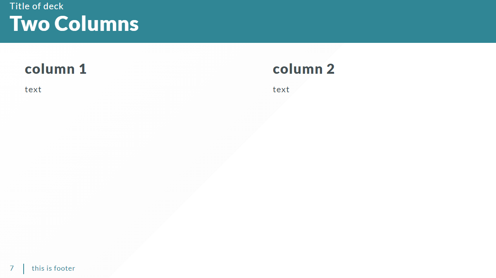
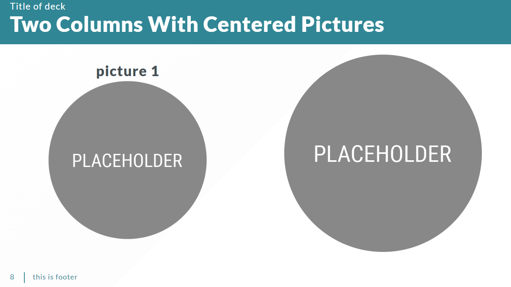
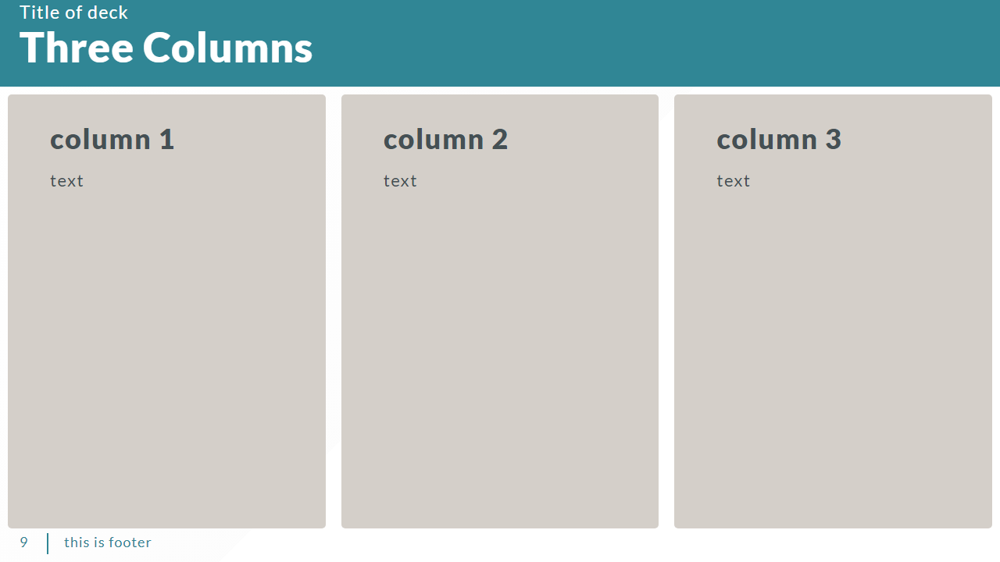
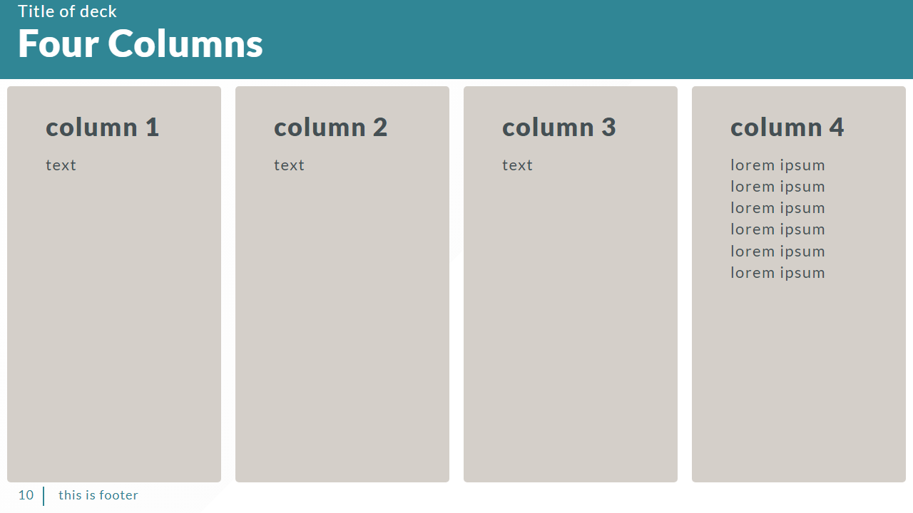
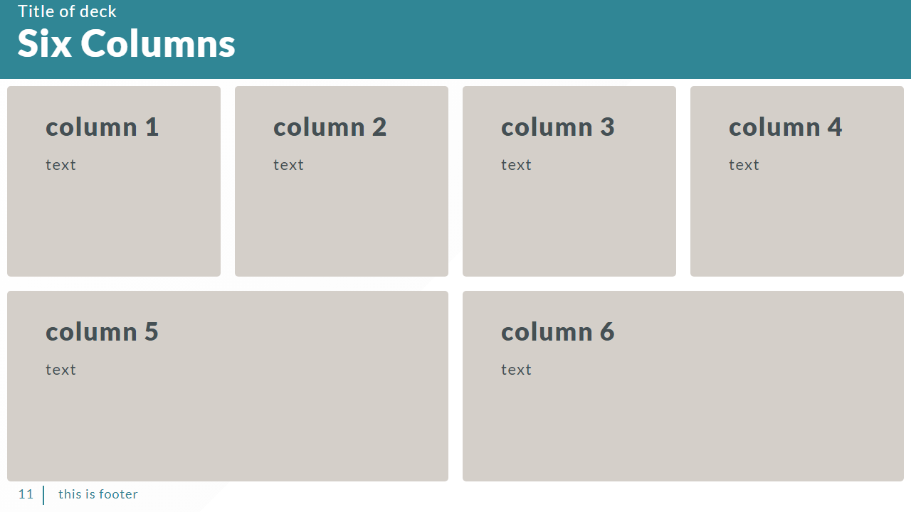
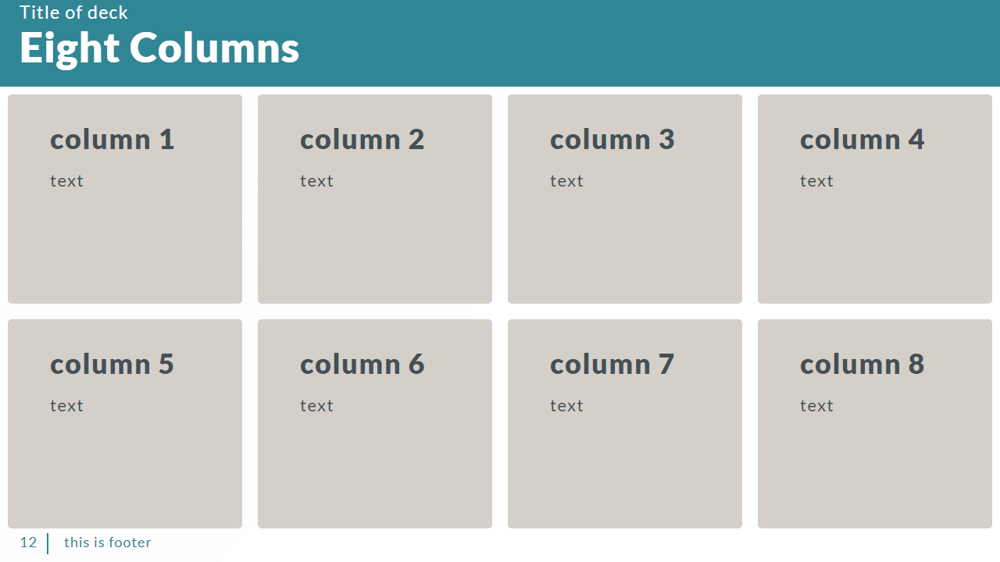



 Marp

 VSCode Plugin

 Obsidian Plugin



---

In this blog post, we will delve into the features that set my Marp template apart, exploring how it seamlessly blends aesthetics with functionality to elevate your presentations to new heights. Whether you're aiming for a sleek corporate pitch, an engaging educational session, or a visually stunning project update, our template is your go-to resource for creating a lasting impression.

Let's embark on a visual voyage that transforms the way you share ideas and captivates your audience from the very first slide.

## 2 Columns

```markdown

--- 
<!-- _class: 'box-flex' -->

## Two Columns 

- ### column 1
	text

- ### column 2
	text

---

```



## 2 Columns with Images

```markdown

--- 
<!-- _class: 'box-flex center' -->

## Two Columns With Centered Pictures

- ### picture 1
	

- 

---

```



## 3 Columns

```markdown

--- 
<!-- _class: 'box-flex box-bg' -->

## Three Columns 

- ### column 1
	text

- ### column 2
	text

- ### column 3
	text

---

```



## 4 columns

```markdown

--- 
<!-- _class: 'box-flex box-bg' -->

## Four Columns 

- ### column 1

	text

- ### column 2

	text

- ### column 3
	text

- ### column 4
	lorem ipsum lorem ipsum lorem ipsum lorem ipsum lorem ipsum lorem ipsum 

---

```



## 6 blocks

```markdown

--- 
<!-- _class: 'box-flex box-bg' -->

## Six Columns 

- ### column 1

	text

- ### column 2

	text

- ### column 3
	text

- ### column 4
	text

- ### column 5
	text

- ### column 6
	text

---

```



## 8 blocks

```markdown

--- 
<!-- _class: 'box-flex box-bg' -->

## Eight Columns 

- ### column 1

	text

- ### column 2

	text

- ### column 3
	text

- ### column 4
	text

- ### column 5
	text

- ### column 6
	text

- ### column 7
	text

- ### column 8
	text
  
---

```



## References

- [Marp](https://marp.app/)
- [VSCode Plugin](https://marketplace.visualstudio.com/items?itemName=marp-team.marp-vscode)
- [Obsidian Plugin](https://github.com/samuele-cozzi/obsidian-marp-slides)
