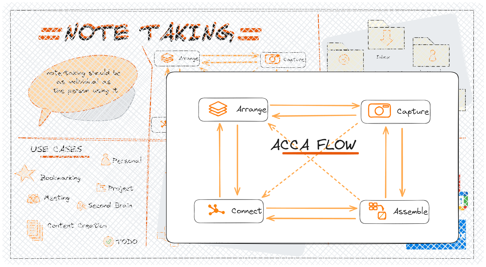

## AccA Flow

Effective note-taking systems are essential for organizing information, managing tasks, and enhancing productivity. This document outlines the AccA (Arrange, Capture, Connect, Assemble) flow within a note-taking system, detailing the specific actions and their roles in optimizing note management. By understanding and implementing these actions, users can create a more structured, efficient, and collaborative environment for handling their notes and ideas.

### Arrange Action in a Note taking System

In a Note taking System, the "Arrange" action plays a crucial role in helping users organize and structure their notes effectively. This action allows users to rearrange their notes, folders, and content in a systematic manner, enabling them to maintain a tidy and logical layout within the system. By utilizing the "Arrange" action, users can customize the order of their notes, group related information together, and create a more coherent workflow for accessing and managing their data.

Moreover, the "Arrange" action facilitates the process of prioritizing and categorizing notes based on their importance or relevance. Users can use this feature to highlight key notes, mark urgent tasks, or segment notes into different categories for better organization. By arranging notes strategically, users can enhance their productivity, streamline their workflows, and ensure that essential information is easily accessible when needed.

Additionally, the "Arrange" action in a Note taking System allows users to optimize the visual presentation of their notes, enhancing readability and usability. By arranging notes in a structured format, users can improve the overall user experience, making it simpler to navigate through their content and locate specific information efficiently. This action empowers users to customize their note-taking environment according to their preferences, creating a personalized and tailored system that supports their individual workflow and note management needs.

### Capture Action in a Note taking System

The "Capture" action in a Note taking System is a fundamental feature that enables users to swiftly gather, record, and store information from various sources. This action serves as a digital notepad where users can capture ideas, insights, and snippets of information on the go, ensuring that important details are not lost or forgotten. Whether it's jotting down quick notes during a meeting, saving web clippings, or recording voice memos, the "Capture" action provides a convenient way to collect and centralize information in one accessible location.

Furthermore, the "Capture" action allows users to streamline the process of inputting data into their Note taking System, eliminating the need to switch between multiple applications or platforms. With a simple click or tap, users can capture text, images, links, and other content directly into their note repository, making it easier to compile and organize information efficiently. This seamless integration enhances productivity and reduces the time spent on manual data entry, enabling users to focus on creating and curating valuable content.

Moreover, the "Capture" action empowers users to capture inspiration and insights in real-time, ensuring that creative ideas are captured promptly before they fade away. By providing a quick and intuitive way to record thoughts and observations, this feature enables users to nurture their creativity, enhance their productivity, and maintain a steady flow of ideas. Whether it's a sudden brainstorm, a fleeting thought, or a profound realization, the "Capture" action ensures that users can capture and preserve these moments for future reference and inspiration.

### Connect Action in a Note taking System

The "Connect" action in a Note taking System plays a pivotal role in linking related notes, ideas, and concepts together, fostering a cohesive and interconnected knowledge base. This feature enables users to establish connections between different pieces of information, creating a web of associations that enhances understanding and facilitates deeper insights. By utilizing the "Connect" action, users can establish meaningful relationships between notes, uncover patterns, and develop a more holistic view of their data.

Moreover, the "Connect" action empowers users to bridge gaps between disparate pieces of information, facilitating cross-referencing and cross-pollination of ideas within the Note taking System. Users can link related notes, reference external sources, or create associations between different topics, enabling them to explore interconnections and discover new perspectives. This interconnected approach to note-taking enhances knowledge discovery, promotes creativity, and encourages a multidimensional understanding of complex subjects.

Additionally, the "Connect" action enhances collaboration and knowledge sharing within a Note taking System by allowing users to establish links between shared notes or collaborative projects. This feature enables users to connect with colleagues, share insights, and build upon each other's ideas in a collaborative workspace. By fostering connections between team members and their contributions, the "Connect" action promotes synergy, encourages information exchange, and facilitates collective learning and innovation within the Note taking System.

### Assemble Action in a Note-taking System

The "Assemble" action in a Note taking System is a crucial functionality that allows users to compile, organize, and structure their notes into coherent collections or projects. This feature enables users to bring together related information, ideas, and resources from various sources, creating a cohesive narrative or presentation. By utilizing the "Assemble" action, users can curate their notes into meaningful sequences, arrange them in a logical order, and create structured outlines for better clarity and comprehension.

Furthermore, the "Assemble" action facilitates the creation of comprehensive reports, presentations, or research papers by providing users with a tool to assemble disparate notes into a unified document. Users can easily gather relevant notes, arrange them in a cohesive manner, and seamlessly transition from brainstorming and ideation to the final output. This feature streamlines the process of compiling information, ensuring that users can efficiently transform their notes into polished deliverables within the Note taking System.

Moreover, the "Assemble" action empowers users to build knowledge repositories, study guides, or project plans by assembling pertinent notes, references, and insights in a structured format. This functionality enables users to consolidate information, extract key points, and synthesize complex ideas into organized frameworks. By assembling notes into coherent structures, users can enhance their understanding of a topic, streamline their learning process, and create valuable resources for future reference and review within the Note taking System.

## Conclusion

The AccA flow in a note-taking system—comprising Arrange, Capture, Connect, and Assemble actions—provides a comprehensive framework for managing and organizing notes. By leveraging these actions, users can enhance their productivity, improve information retrieval, and foster collaboration. Adopting this structured approach not only streamlines the note-taking process but also supports better decision-making and knowledge sharing, ultimately leading to more effective and organized workflows.
