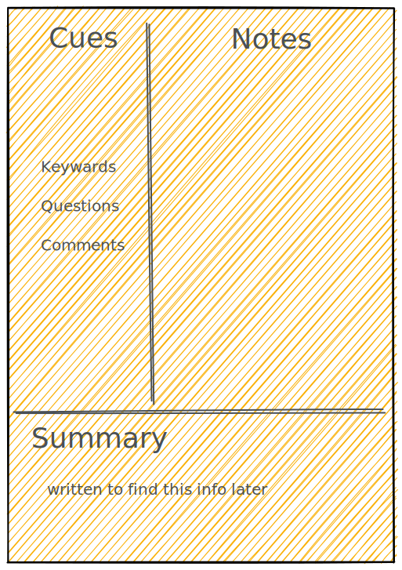
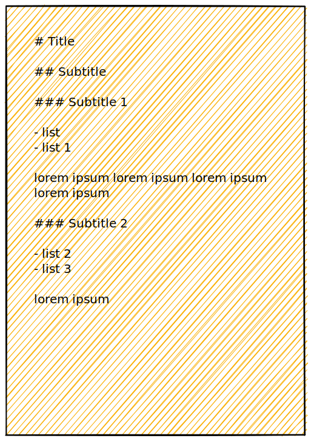
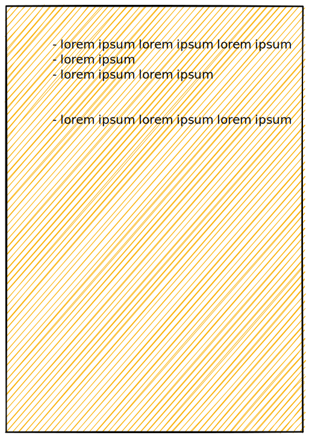
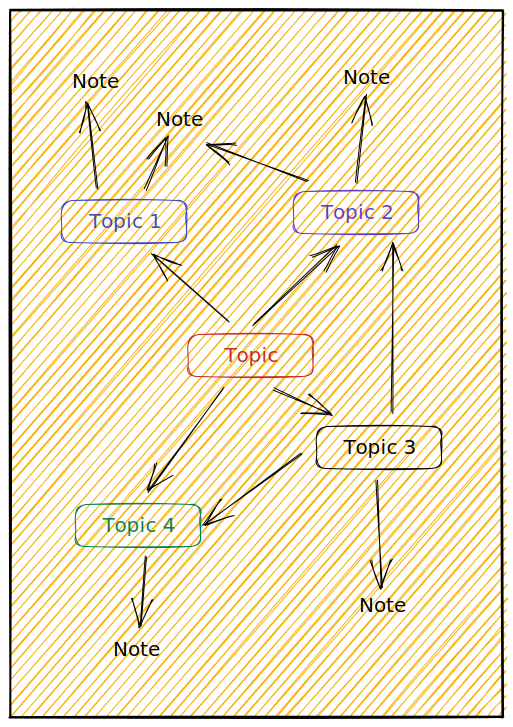
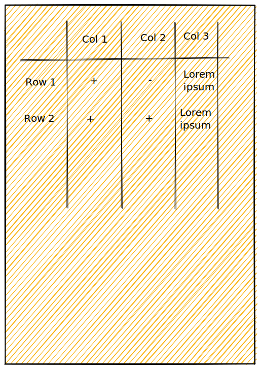
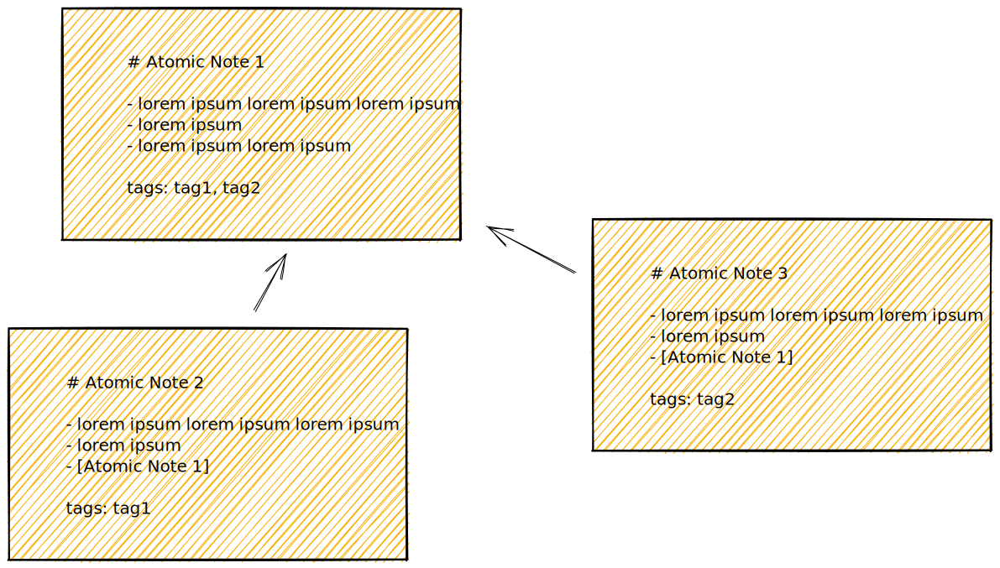

Note-taking is a crucial skill that helps individuals organize, retain and recall information. There are various note-taking methodologies that one can employ depending on the purpose, style and preference.

## Methodologies

### Cornell Method

The [Cornell note-taking method](https://e-student.org/cornell-note-taking-method/), developed over half a century ago, is a tried-and-true strategy for taking effective notes. It uses two top columns (the “cue” and “note” columns), together with a single bottom row (the summary section), to record notes. 

The method is versatile, usable for most subjects, and one of the simplest yet most effective note-taking methods. By mastering the Cornell system, you’ll always have at least one solid note-taking skill under your belt. The Cornell system is one of the most popular note-taking strategies in the world for a good reason.

In the realm of Markdown, incorporating the Cornell Method involves leveraging the front matter section for cues and integrating links for an organized approach to note-taking. By utilizing the front matter to define cues and categories, Markdown users can structure their notes according to the Cornell Method's principles. Additionally, utilizing hyperlinks within the Markdown content allows for seamless referencing and cross-referencing, enabling users to navigate between cues and their corresponding notes effortlessly. This fusion of front matter cues and hyperlinked content emulates the systematic and efficient note-taking style of the Cornell Method, enhancing the overall organization and accessibility of the information within the Markdown document.

Advantages:

- Organized and systematic for both recording and reviewing notes
- Time-efficient and requires little effort,
- Taking Cornell notes is very easy to learn,
- Suitable for most subjects (except equation-based subjects),
- Fulfills a [natural learning cycle](https://files.eric.ed.gov/fulltext/EJ1205170.pdf) within one single page,
- Ideal for extracting major concepts and ideas.

Disadvantages:

- Requires creating or purchasing Cornell-style pages,
- Large quantities of Cornell notes can be challenging to organize,
- Not great at reducing the size of notes,
- [Research on the Cornell method](https://e-student.org/cornell-note-taking-method/#scientific-studies-on-the-effectiveness-of-cornell-notes) is mixed.

**Best for:** Recording main concepts & forming study questions
**Difficulty level:** Easy

### Outline Method

The [outline method of note-taking](https://e-student.org/outline-note-taking-method/) uses indentation to store information in a clear hierarchy. When applicable, the outline method is one of the most efficient note-taking formats as it creates meticulously well-organized notes. The method can also be used in both [deductive and inductive](https://web.archive.org/web/20210725100355/https://www.lamission.edu/devcom/NotetakingSystems.html) order.

Outlined notes are some of the easiest to review, as it’s one of the few systems that allow you to see space relationships between topics. However, the method is not always suitable for taking notes during a live lecture, and outlining requires a clear lesson structure.

Advantages:

- Space relationships between topics are visible,
- Information is recorded in a logical, hierarchical manner,
- Outlined notes are quick and easy to review pre-exam,
- Special notepaper & preparation not required,
- [Research on the outline method](https://e-student.org/outline-note-taking-method/#what-do-researchers-say-about-outlining) has been positive,
- Usable during class (slow to medium-paced lectures).

Disadvantages:

- Unsuitable for some STEM subjects,
- Learning materials/lectures require a clear structure,
- Outlining notes requires intense concentration and thought.

**Best for:** Most subjects except science classes such as physics or math
**Difficulty level:** Medium

### Sentence Method

The [sentence method of note-taking](https://e-student.org/sentence-note-taking-method/) uses sentences separated by lines to quickly transcribe as much information as possible from the information source. It requires quick handwriting or typing skills to be used effectively, and it’s likely the most commonly used note-taking method due to its simplicity. 

Using the sentence method results in oversized notes that are notoriously difficult to review afterward. However, the sentence method can sometimes be the only viable choice for fast-paced, unstructured lessons you’re unprepared for. It’s often a good idea to rewrite notes taken with the sentence method after class.

Try not to rely on this method when you have a choice, but keep it as a backup plan when you can’t use an alternative note-taking strategy.

Advantages:

- It can be used for any subject and type of class,
- Very easy to implement,
- Suitable for quick note-taking during class.

Disadvantages:

- Reviewing sentence method notes after class is difficult and time-consuming,
- No inter- and intra- relationships between notes are visible,
- The main points are indistinguishable from more minor details,
- Quick handwriting or typing speed required,
- No element of metacognitive note analysis during note-taking.

**Best for:** Quick, unstructured note-taking
**Difficulty level:** Very easy

### Mind Mapping

The [mapping method of note-taking](https://e-student.org/mapping-note-taking-method/), also known as “concept mapping,” connects different thoughts, ideas, concepts, and facts through visualization. Both Leonardo Da Vinci’s and Albert Einstein’s notebooks [reportedly](https://www.irishtimes.com/business/how-tony-buzan-used-mind-maps-to-doodle-his-way-to-millions-1.2230977) contained mapping-style notes that connected drawings to words and notes.

The mapping method starts with a central topic in the middle of the page before branching into smaller subtopics, supporting topics, and more minor details. The method provides a one-of-a-kind graphical overview of lecture content that is irreplaceable for visual learners. 

Mapping is best used in content-rich college classes where the information is structured. However, taking notes in a live class with this method is very rarely possible due to its time-consuming nature.

 Advantages:

- An excellent method for visual learning styles,
- It gives a comprehensive overview of a large subject,
- It helps you understand the connections between small elements within a major topic,
- Maximizes active participation,
- Reviewing mapped notes is very efficient.

 Disadvantages:

- Requires a good understanding of the topic,
- Requires strong concentration,
- It cannot be used effectively during class,
- It can be [difficult to correctly include all relationships](https://www.atiner.gr/2020/Lu.pdf),
- Mapping is very time-consuming.

**Best for:** Analyzing visual connections between key ideas and concepts
**Difficulty level:** Hard

### Charting Method

The [charting method of note-taking](https://e-student.org/charting-note-taking-method/), also known as “matrix note-taking,” uses charts to classify information within rows and columns. While the method is not usable for many subjects, it is a remarkable tool under the right circumstances. This method is best used with subjects with factual or statistical information that can be categorized into tables.

On the other hand, it’s not suitable for note-taking during live lectures, very detailed topics, and subjects where the space relationships between content are essential. It’s also not well-suited for subjects that have many equation-based problems.

Advantages:

- A compelling method for subjects with lots of facts and statistics,
- Easy comparisons between different topics,
- Reduces note sizes better than any other method,
- Charted notes are straightforward and efficient to review,
- Very efficient for studying comparisons.

Disadvantages:

- Unsuitable for most subjects,
- Requires a basic understanding of the topic,
- Very time-intensive.

**Best for:** Recording facts and statistics
**Difficulty level:** Hard

### Zettelkasten Method

The **Zettelkasten method** is a personal knowledge management system that involves creating a collection of notes that are linked together through subject headings or other metadata such as numbers and tags. The notes are typically stored on index cards or in a digital format, and each note contains a single idea or concept. The Zettelkasten method is known for its ability to help you organize your knowledge while working, improve your memory and knowledge retention, and develop knowledge relationships that significantly improve memory recall.

Advantages:

- Helps you create a comprehensive and interconnected database of your ideas and knowledge .
- Allows you to easily find related information and develop new insights.
- Improves your memory and knowledge retention by encouraging you to actively engage with the information you are recording.

Disadvantages:

- Can be time-consuming to set up and maintain.
- Can be challenging to keep track of all the connections between your notes as your collection grows.

**Best for:** Create a comprehensive and interconnected database of ideas and knowledge.
**Difficulty level:** Hard

### Sketchnotes

**Sketchnotes** are a form of visual note-taking that involves combining words and images to capture and convey information. Instead of traditional linear note-taking methods, sketchnotes use a combination of drawings, icons, and text to create a more visually engaging and memorable representation of ideas. Sketchnoting is often used in various contexts, such as conferences, lectures, meetings, and brainstorming sessions.

Advantages:

1. **Enhanced Memory Retention:** Visual elements in sketchnotes can help improve memory retention. The combination of text and images makes it easier for the brain to recall information.
2. **Increased Engagement:** Sketchnotes can make note-taking more enjoyable and engaging. People who may find traditional note-taking methods boring might be more motivated to take notes if they can incorporate visual elements.
3. **Improved Comprehension:** Visual representations can aid in understanding complex concepts. Sketchnotes provide a holistic view of information, helping individuals grasp the overall meaning and connections between ideas.
4. **Creativity and Personalization:** Sketchnotes allow for a high degree of creativity and personalization. Individuals can use their unique drawing styles and symbols to represent concepts, making the notes more reflective of their understanding and perspective.
5. **Communication Aid:** Sketchnotes can be effective in communicating ideas to others. They serve as a visual summary that is quick to understand, making it easier to share information with colleagues, classmates, or anyone else.

Disadvantages

1. **Time-Consuming:** Creating detailed sketchnotes can be time-consuming, especially for those who are not experienced in drawing. This may be a drawback in situations where time is limited, such as during fast-paced lectures or meetings.
2. **Skill Requirement:** Some people may feel intimidated by the artistic aspect of sketchnoting, believing that they lack the necessary drawing skills. This could discourage individuals from adopting this note-taking method.
3. **Distraction:** While sketchnoting can enhance engagement for some, it might be distracting for others. Focusing on drawing may divert attention away from the speaker or the main content being discussed.
4. **Limited Detail:** In situations where detailed and precise information is crucial, sketchnotes may fall short. The emphasis on visuals may sacrifice the depth of information captured in comparison to traditional text-based notes.
5. **Not Universally Applicable:** Sketchnotes may not be suitable for every learning or working style. Some individuals may prefer more linear and text-based notes for better organization and clarity.

**Best for:** Create a comprehensive and engaging representation of ideas
**Difficulty level:** Hard

## References

- [The 9 Most Effective Note-Taking Methods - E-Student](https://e-student.org/note-taking-methods/)
- [Note-taking | Academic Resource Center](https://academicresourcecenter.harvard.edu/note-taking)
- [3 Note-Taking Methodologies To Help With Productivity](https://www.forbes.com/sites/forbesbusinesscouncil/2021/07/08/3-note-taking-methodologies-to-help-with-productivity/?sh=25d0f9a1d709)
- [The Best Note-Taking Methods for College Students &amp; Serious Note-takers | GoodNotes Blog](https://www.goodnotes.com/blog/note-taking-methods)
- [How to Take Great Notes: The Best Note-Taking Systems Illustrated | by Valerie | Dare To Be Better | Medium](https://medium.com/dare-to-be-better/how-to-take-great-notes-the-best-note-taking-system-illustrated-ef093809e9b0)
- [Zettelkasten vs other note-taking systems: Which system is best suited for academics and lifelong learners? | Traverse](https://traverse.link/note-taking/zettelkasten)
- [How to use Zettelkasten to boost your creativity and productivity | Zapier](https://zapier.com/blog/zettelkasten-method/)
