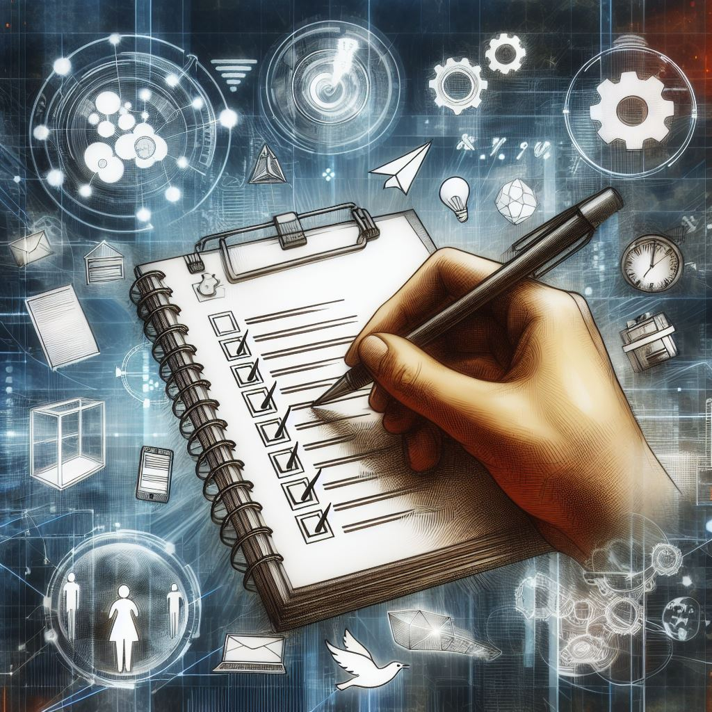
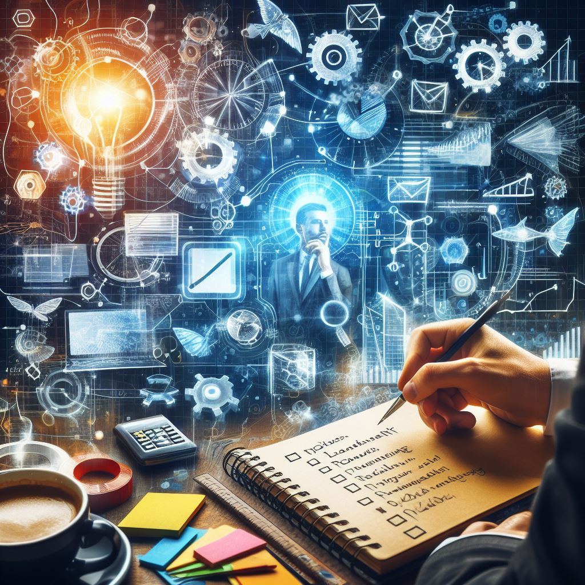

Note-taking is a fundamental human activity, but its potential goes far beyond simply capturing fleeting thoughts. By understanding different use cases, you can transform your notes from a passive record to a powerful tool that fuels productivity, creativity, and knowledge accumulation. Let's delve into how strategic note-taking can supercharge various aspects of your life:

## Personal Life & Private Management

We all juggle a million things. Use notes to tame the chaos! Capture grocery lists, movie recommendations, travel ideas, and anything else that clutters your mind. Digital notes with searchable keywords become an instant retrieval system, ensuring you never forget that perfect recipe or the must-see museum on your travel wishlist. Imagine whipping out your phone at the store with a meticulously crafted shopping list, complete with dietary restrictions and quantities, or referencing your travel notes while exploring a new city – all thanks to the power of organized notes.

## Meeting

Meetings are crucial for collaboration, but they can also be breeding grounds for confusion. Clear and concise notes ensure everyone's on the same page. Capture action items, deadlines, and key points. Digital note-taking tools with collaboration features allow real-time edits and shared access, creating a unified record everyone can reference later. No more struggling to decipher cryptic handwritten notes or piecing together fragmented memories of a meeting – your notes become a central hub for keeping everyone aligned.

## Building Your Second Brain

Information overload is a modern-day struggle. Notes can be your external brain, a trusted repository for knowledge and inspiration. Articles, quotes, research snippets – dump it all in and leverage powerful search and organization features to find exactly what you need when you need it. Imagine cultivating a digital library of your curated knowledge, meticulously categorized and tagged for effortless retrieval. Need to brush up on a specific concept for a project? Your second brain has it at the ready, complete with relevant excerpts and your own insights.

## Content Creation

Writers and creatives thrive on brainstorming. Notes are your idea playground. Jot down fleeting thoughts, explore different angles, and organize them for future reference. Digital note-taking apps often allow multimedia integration, making it easy to incorporate images, audio recordings, and even web clippings into your creative process. Imagine capturing a sudden burst of inspiration on your phone, then seamlessly adding it to your digital notebook alongside voice memos with character dialogue and sketches of potential scenes. There's no limit to the creative possibilities unleashed by well-organized notes.

## To-Do Lists

Ditch the sticky notes! Digital notes can be your central hub for tasks. Create checklists, set reminders, and track progress. Integrate your notes with project management tools for a seamless workflow. Say goodbye to losing track of to-dos scrawled on random scraps of paper. Your notes become a dynamic system that keeps you accountable and ensures nothing slips through the cracks.

## Project Management

Juggling multiple projects can be overwhelming. Use notes to break down projects into subtasks, outline workflows, and track milestones. Utilize features like tagging and categorization to keep everything organized and readily accessible. Imagine having a dedicated digital space for each project, where you can map out every step of the process, brainstorm ideas, and store all relevant documents and resources. This way, you approach each project with a clear roadmap and all the information you need at your fingertips.

## Bookmarking

Don't let those inspiring articles or research papers disappear into the abyss of your browser history. Use note-taking tools to store web clippings with annotations and tags. This not only keeps them organized but also allows you to revisit key takeaways and integrate them into your broader knowledge base. Imagine encountering a fascinating article online, but instead of just passively bookmarking it, you can save it to your notes with your own insights and reflections jotted down alongside. This way, you can revisit these valuable resources with added context and purpose, transforming them into stepping stones on your learning journey.

By embracing the diverse applications of note-taking, you unlock a world of potential for boosting productivity, sparking creativity, and achieving your goals. So next time you reach for a pen, consider the power of using notes strategically. They can be the key to a more organized, efficient, and inspired way of working and living.

## References

- [3 Note-Taking Methodologies To Help With Productivity](https://www.forbes.com/sites/forbesbusinesscouncil/2021/07/08/3-note-taking-methodologies-to-help-with-productivity/?sh=25d0f9a1d709)
