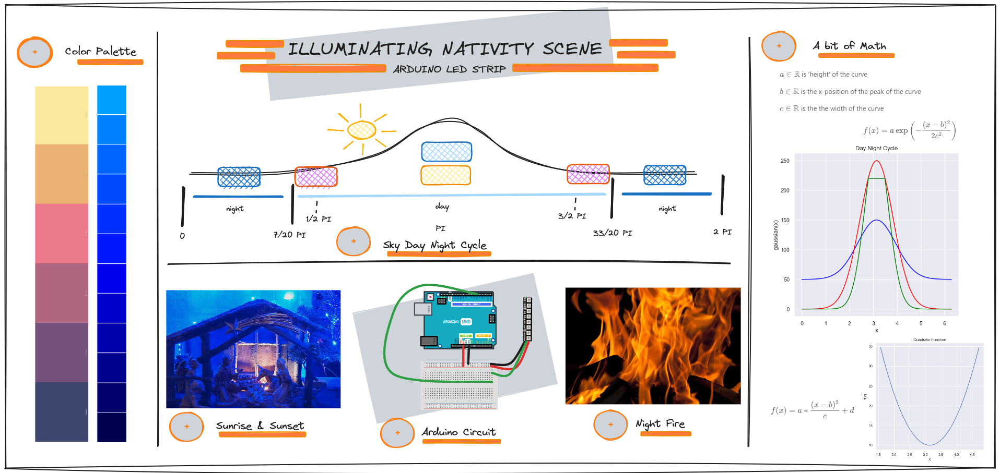
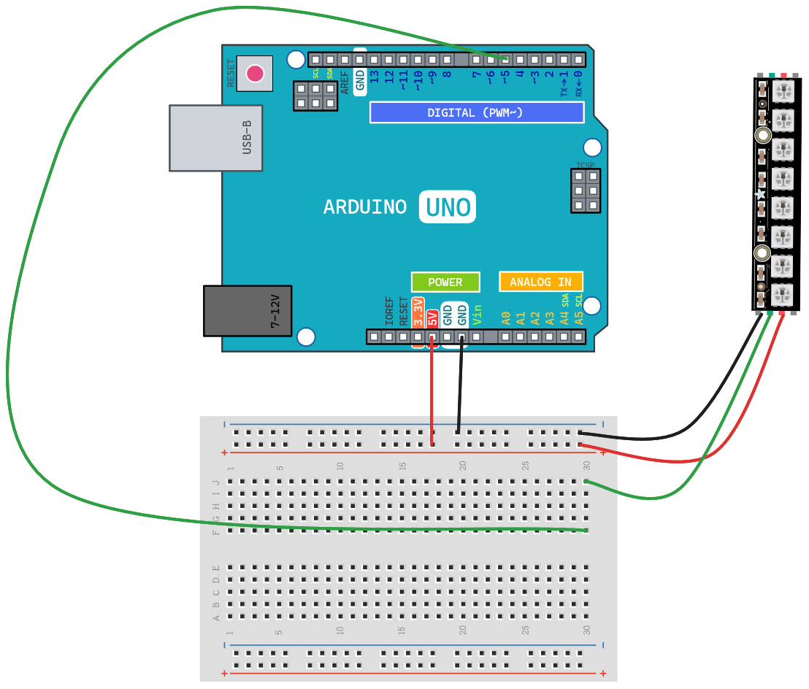
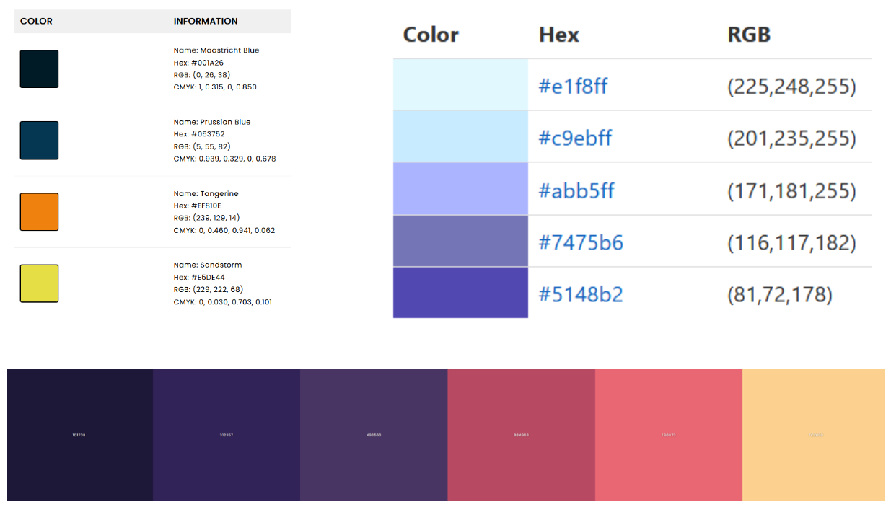





---

The primary objective of my Arduino project is to enhance the visual appeal of the nativity scene through an intricately designed lighting system. One key aspect of the project is to create a realistic day/night cycle that mirrors the natural progression of time. During the day, the Arduino-controlled LEDs will simulate the beauty of sunrise, sunset, and the warm glow of daylight. This dynamic lighting scheme aims to add a touch of authenticity to the nativity scene, creating a visual narrative that resonates with the observer. By incorporating this day/night cycle, the project seeks to capture the essence of different times of day, fostering a deeper connection to the scene and its symbolic significance.

Additionally, the project aims to bring a sense of warmth and tranquility to the nativity scene during the night. To achieve this, the Arduino will be programmed to simulate the flickering flame of a fire, casting a gentle, ambient glow on the surroundings. This nighttime illumination not only adds a visual element of coziness but also contributes to the overall atmospheric ambiance, creating a serene and contemplative environment around the nativity scene. Through the combination of the day/night cycle and the simulated firelight, the Arduino project endeavors to elevate the nativity scene into a captivating and immersive experience, resonating with both the symbolism of the scene and the emotional connection of the observer.



### Hardware Build

The circuit of this project is very easy, it has connected:

- the [Arduino UNO](https://docs.arduino.cc/hardware/uno-rev3) microcontroller board
- the [WS2812B Digital RGB LED](https://www.amazon.it/gp/product/B01CDTED80/ref=ppx_yo_dt_b_asin_title_o05_s00?ie=UTF8&psc=1)

The WS2812B is a popular type of Digital RGB LED that has gained widespread use in various electronic projects due to its simplicity and versatility. Also known as NeoPixels in Adafruit's product line, the WS2812B integrates a bright RGB (Red, Green, Blue) LED and a control circuit into a single compact package. One of the key features of the WS2812B is its ability to be individually addressable, meaning each LED in a chain can have its own unique color and brightness controlled independently.

The communication protocol of WS2812B LEDs is daisy-chained, allowing multiple LEDs to be connected in series. Data is transmitted through the chain, and each LED interprets the relevant information for its color and intensity. This simplifies wiring and makes it easy to create dynamic lighting effects. The WS2812B operates on a low voltage and is compatible with microcontrollers like Arduino, Raspberry Pi, and others. Its compact size, ease of use, and vibrant illumination make it a popular choice for various applications, including decorative lighting, wearable electronics, and interactive art projects.

### Theory Build

#### Get Inspired from color palette

The inspiration for the color palette in this project draws heavily from the captivating hues of the sky during different phases of the day. The soft pastel tones of the morning sky during sunrise, with its gentle pinks, oranges, and purples, serve as a muse for creating a warm and inviting ambiance. As the day progresses, the vibrant colors of the midday sun and the clear, bright blue sky influence the daylight simulation, infusing the nativity scene with a sense of vibrancy and life. During the evening, the project is inspired by the serene and calming shades of a sunset, incorporating rich reds, purples, and deep oranges to evoke a peaceful transition into the night. The subtle gradations of color observed in the sky serve as a guide, allowing the project to authentically replicate the beauty of nature in its various forms, enhancing the overall visual experience of the nativity scene. The careful consideration of the sky's color palette aims to evoke a connection with the natural world and the emotions associated with different times of the day, making the project both visually compelling and emotionally resonant.

#### A little bit of math (Gaussian and Quadratic functions)

In this project, the Gaussian function is instrumental in simulating the day/night cycle colors. Its smooth and continuous curve allows for a realistic transition between different phases of the day, mimicking natural lighting changes. The function accurately captures the nuances of a sunrise's soft hues, the vibrancy of daylight, and the calming tones of a sunset. By employing the Gaussian function, the color modulation achieves a sophisticated and visually appealing effect, closely aligning with the gradual transitions observed in the sky. This mathematical approach enhances the immersive quality of the illuminated nativity scene, making the Gaussian function a powerful tool for replicating the subtleties of atmospheric shifts in the simulated lighting.

Utilizing a quadratic function is pivotal in this project to simulate the diffusion of light during sunrise and sunset, as well as to control the movement of the sun. The quadratic function's parabolic shape effectively models the gradual spread of light, creating a realistic effect during these transitions. For sunrise, the function mimics the gentle emergence of sunlight, while during sunset, it replicates the atmospheric diffusion. Additionally, the quadratic function defines the sun's trajectory across the sky, adding dynamic realism to the day/night cycle in the illuminated nativity scene. Its versatility enhances the overall visual experience by providing a nuanced simulation of natural lighting phenomena.

#### Sky Day and Night Cycle

The day and night implementation in this project adopts a cyclic representation with a period of 2π, symbolizing a full day. The visual depiction of this implementation is illustrated in the accompanying picture. Through careful use of mathematical functions like the Gaussian and quadratic functions, the project dynamically orchestrates the transitions between day and night. The cyclic nature of the model ensures a seamless and continuous simulation of the day/night cycle, with the period of 2π encapsulating the entirety of a day. This approach not only provides a realistic representation of the natural ebb and flow of light but also offers a visually engaging experience for the observer as they witness the cyclical transformation within the illuminated nativity scene.

### Software Build

The software for this project is crafted for efficiency and adaptability, leveraging the FastLED library to seamlessly communicate with the LED strip. FastLED proves invaluable in controlling the WS2812B Digital RGB LEDs, providing precise color manipulation and dynamic animation capabilities. This project takes advantage of the PlatformIO extension for Visual Studio Code, offering a streamlined development environment.

The combination of FastLED and PlatformIO ensures smooth and responsive control over lighting effects, making it easy to implement intricate color patterns and dynamic sequences. With PlatformIO's integration into Visual Studio Code, developers benefit from a user-friendly interface and efficient coding environment, fostering a seamless development process. This comprehensive approach underscores the project's commitment to creating captivating and immersive lighting displays for the nativity scene, facilitated by the powerful combination of FastLED and PlatformIO.

**Math Notes**

[ipynb](attachments/day-night-cycle.ipynb)

## Further information

- [Hackster Project](https://www.hackster.io/samuele-cozzi/illuminating-the-nativity-scene-for-christmas-7d1d88)
- [Github Project Code](https://github.com/samuele-cozzi/arduino-led-strip)
