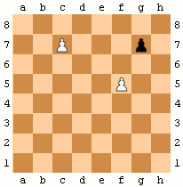

Chess is a two-player strategy board game that requires skill, critical thinking, and analytical reasoning. The game involves moving pieces on a square board with the ultimate objective of capturing the opponent's King.

The game of chess originated in ancient India over 1500 years ago and has since spread to become one of the most popular games globally. A standard chess set consists of 32 pieces per player: one king, one queen, two rooks, two knights, two bishops, and eight pawns.

Players take turns moving their pieces according to specific rules and constraints. The game requires a deep understanding of tactics, strategy, and psychological manipulation as players aim to outmaneuver each other.

## Rules

The rules of chess are published by [FIDE](https://handbook.fide.com/chapter/E012023) (Fédération Internationale des Échecs; "International Chess Federation"), chess's world governing body, in its Handbook.

### Setup

To start the game, White's pieces are placed on the first rank in the following order, from left to right: rook, knight, bishop, queen, king, bishop, knight, rook. Pawns are placed on each square of the second rank. Black's position mirrors White's, with equivalent pieces on every file.[2] The board is oriented so that the right-hand corner nearest each player is a light square; as a result the white queen always starts on a light square, while the black queen starts on a dark square. This may be remembered by the phrases "white on the right" and "queen on her color".

### Basic Movements

- The king moves one square in any direction. There is also a special move called castling which moves the king and a rook. The king is the most valuable piece—it is illegal to play any move that puts one's king under attack by an opponent piece. A move that attacks the king must be parried immediately; if this cannot be done, the game is lost. (See § Check and checkmate.)
- A rook can move any number of squares along a rank or file. A rook is involved in the king's castling move.
- A bishop can move any number of squares diagonally.
- A queen combines the power of a rook and bishop and can move any number of squares along a rank, file, or diagonal.
- A knight moves to any of the closest squares that are not on the same rank, file, or diagonal. (Thus the move forms an "L"-shape: two squares vertically and one square horizontally, or two squares horizontally and one square vertically.) The knight is the only piece that can leap over other pieces.
- A pawn can move forward to the unoccupied square immediately in front of it on the same file, or on its first move it can optionally advance two squares along the same file, provided both squares are unoccupied (diagram dots). A pawn can capture an opponent's piece on a square diagonally in front of it by moving to that square (diagram crosses). It cannot capture a piece while advancing along the same file, nor can it move to either square diagonally in front without capturing. Pawns have two special moves: the en passant capture and promotion.

### Special Movements

#### Check and CheckMate

When a king is under immediate attack, it is in check. A move in response to a check is legal only if it results in a position in which the king is no longer in check.

The object of the game is to checkmate the opponent; this occurs when the opponent's king is in check, and there is no legal way to get it out of check.

#### Castling

Kings can castle once per game. Castling consists of moving the king two squares toward either rook of the same color, and then placing the rook on the square that the king crossed.

Castling is possible only if the following conditions are met:

- Neither the king nor the rook has previously moved during the game.
- There are no pieces between the king and the rook.
- The king is not in check and does not pass through or finish on a square controlled by an enemy piece.

Castling is still permitted if the rook is under attack, or if the rook crosses an attacked square.

#### Special pawn moves

- En passant: when a pawn makes a two-square advance to the same rank as an opponent's pawn on an adjacent file, that pawn can capture it en passant ("in passing"), moving to one square behind the captured pawn. A pawn can only be captured en passant on the turn after it makes a two-square advance. In the animated diagram, the black pawn advances two squares from g7 to g5, and the white pawn on f5 takes it en passant, landing on g6.
- Promotion: when a pawn advances to its last rank, it is promoted and replaced with the player's choice of a queen, rook, bishop, or knight. Usually, pawns are promoted to queens; choosing another piece is called underpromotion.

### End of the Game

#### Win

- Checkmate: The opposing king is in check and the opponent has no legal move. (See § Check and checkmate.)
- Resignation: A player may resign, conceding the game to the opponent.[6] If, however, the opponent has no way of checkmating the resigned player, this is a draw under FIDE Laws.[2] Most tournament players consider it good etiquette to resign in a hopeless position.[7][8]
- Win on time: In games with a time control, a player wins if the opponent runs out of time, even if the opponent has a superior position, as long as the player has a theoretical possibility to checkmate the opponent were the game to continue.
- Forfeit: A player who cheats, violates the rules, or violates the rules of conduct specified for the particular tournament can be forfeited. Occasionally, both players are forfeited.[2]

## Theory

Chess theory divides chess games into three phases with different sets of strategies: the opening, the middlegame, and lastly the endgame. There is no universally accepted way to delineate the three phases of the game; the middlegame is typically considered to have begun after 10–20 moves, and the endgame when only a few pieces remain.

### Tactics

Tactics are **short-term** sequences of moves that players use to gain an advantage. They often involve combinations, which are sequences of moves that lead to a specific goal, such as winning material or delivering checkmate. Common tactical motifs include forks, pins, skewers, discovered attacks, and double checks.
Tactics are often used to exploit weaknesses in the opponent's position, such as unprotected pieces or vulnerable squares. Players must be able to recognize tactical opportunities and calculate variations to determine the best course of action.

### Strategy

Strategy refers to the **long-term** planning and positioning of pieces to achieve a favorable position. It involves understanding pawn structures, piece coordination, and controlling key squares on the board. Strategic concepts include space advantage, piece activity, and king safety.
Players must develop their pieces harmoniously, control the center of the board, and create weaknesses in the opponent's position. Good strategic play often leads to tactical opportunities, and players must balance both aspects of the game to succeed.

## Phases of the Game

Chess games are divided into three phases: the opening, the middlegame, and the endgame. Each phase has its own strategies and tactics, and players must adapt their play accordingly.

### Openings

Sequences of opening moves are referred to as openings and are catalogued in reference works, such as the Encyclopaedia of Chess Openings. There are thousands of openings, though only a small fraction of them are commonly played.

The fundamental strategic aims of most openings are similar:

- Development: moving pieces (particularly bishops and knights) forward to squares on which they are useful (defending, attacking, and controlling important squares) or have the potential to take part in future plans and ideas.
- Control of the center: control of the central squares allows pieces to be moved to any part of the board relatively easily, and can inhibit the mobility of the opponent's pieces.
- King safety: typically secured by castling; incorrectly timed castling can be wasteful or even harmful, however.
- Pawn structure: players strive to avoid the creation of pawn weaknesses such as isolated, doubled, or backward pawns – and to force such weaknesses in the opponent's position.

Most players and theoreticians consider that White, by virtue of the initiative granted from moving first, begins the game with a small advantage. Black usually strives to neutralize White's advantage and achieve equality, or to develop dynamic counterplay in an unbalanced position.

### Middlegame

The middlegame is the part of the game that starts after the opening. Because the opening theory has ended, players have to form plans based on the features of the position, and at the same time take into account the tactical possibilities of the position. The middlegame is the phase in which most combinations occur. Combinations are a series of tactical moves executed to achieve some gain. Middlegame combinations are often connected with an attack against the opponent's king.
The middlegame is also the stage of the game in which players often try to improve their position by maneuvering their pieces, exchanging pieces, and creating weaknesses in the opponent's position. Players may also try to create threats against the opponent's king or other important pieces.

### Endgame

The endgame (also end game or ending) is the stage of the game when there are few pieces left on the board. There are three main strategic differences between earlier stages of the game and the endgame:

- Pawns become more important. Endgames often revolve around endeavors to promote a pawn by advancing it to the furthest rank.
- The king, which requires safeguarding from attack during the middlegame, emerges as a strong piece in the endgame. It is often used to protect its own pawns, attack enemy pawns, and hinder moves of the opponent's king.
- Zugzwang, a situation in which the player who is to move is forced to incur a disadvantage, is often a factor in endgames but rarely in other stages of the game. In the example diagram, either side having the move is in zugzwang: Black to move must play 1...Kb7 allowing White to promote the pawn after 2.Kd7; White to move must permit a draw, either by 1.Kc6 stalemate or by losing the pawn after any other legal move.

Endgames can be classified according to the type of pieces remaining on the board. Basic checkmates are positions in which one side has only a king and the other side has one or two pieces and can checkmate the opposing king, with the pieces working together with their king. For example, king and pawn endgames involve only kings and pawns on one or both sides, and the task of the stronger side is to promote one of the pawns. Other more complicated endings are classified according to pieces on the board other than kings, such as "rook and pawn versus rook" endgames.

## References

- [Chess Wiki](https://en.wikipedia.org/wiki/Chess)