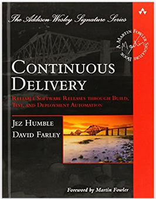
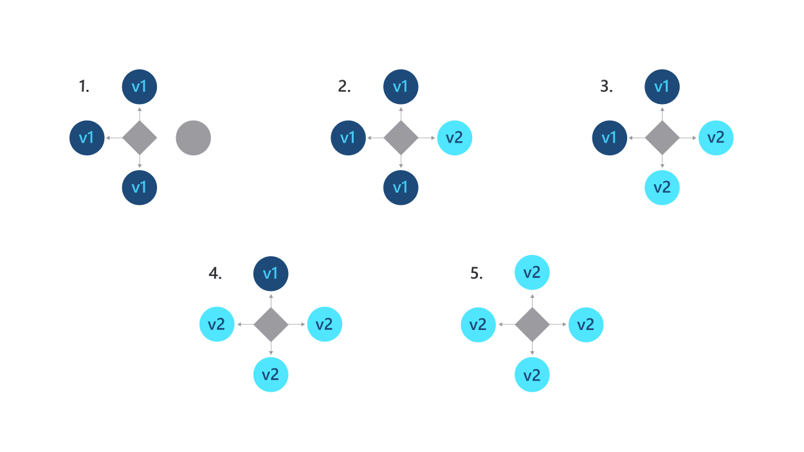
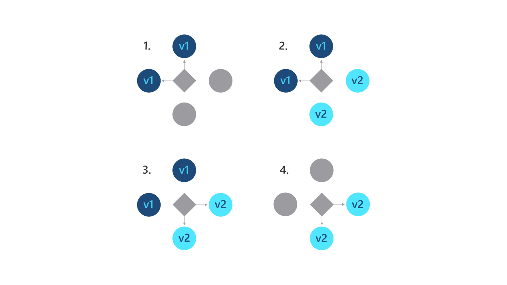
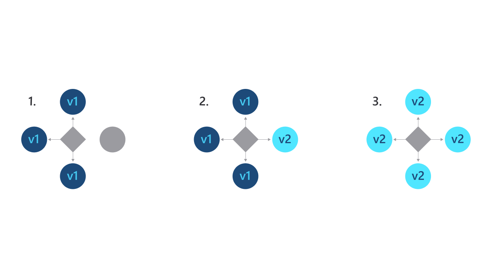
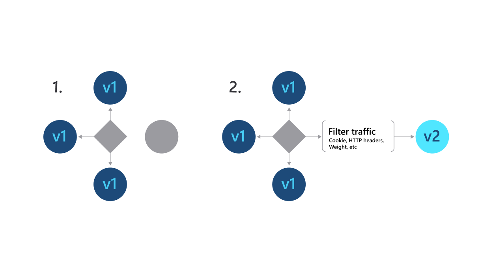

<!-- _class: 'lead' -->

# CI/CD

### A DevOps Practice

Samuele Cozzi

---
# Agenda

1. Continuos Integration
2. Continuos Delivery
3. Continuos Deploymnet
4. Benefits
5. Deployment Strategies
6. Rferences

---
<!-- _class: 'vertical-center' -->

> **Continuous integration (CI)** is the DevOps **practice** of automating the integration of code changes from multiple contributors into a single software project. It’s a primary DevOps best practice, allowing developers to frequently merge code changes into a central repository where **builds and tests**.

[Learn more](https://www.atlassian.com/continuous-delivery/continuous-integration#:~:text=Continuous%20integration%20(CI)%20is%20the,builds%20and%20tests%20then%20run.)

---
<!-- _class: 'vertical-center' -->

> **Continuous delivery** is a DevOps **practice** where code changes are automatically **prepared for a release** to production. A pillar of modern application development, continuous delivery expands upon continuous integration by deploying all code changes to a testing environment and/or a production environment after the build stage. 

[Learn more](https://aws.amazon.com/devops/continuous-delivery/)

---
<!-- _class: 'vertical-center' -->

  

> **Continuous Deploy** is the ability to get changes - features, configuration changes, bug fixes, experiments - into production or into the hands of users safely and quickly in a sustainable way

[Learn more](https://www.amazon.com/Continuous-Delivery-Deployment-Automation-Addison-Wesley/dp/0321601912)

---
<!-- _class: 'box-flex box-center' -->

# CI/CD

- **Continuous Integration**
  - Build: **A**
  - Unit Test: **A**
  ---
  - Artifacts: M
  - Deploy to Test: M
  - Run Tests: M
  - Deploy to Prod: M
  
- **Continuous Delivery**
  - Build: **A**
  - Unit Test: **A**
  - Artifacts: **A**
  - Deploy to Test: **A**
  ---
  - Run Tests: M
  - Deploy to Prod: M

- **Continuous Deploy**
  - Build: **A**
  - Unit Test: **A**
  - Artifacts: **A**
  - Deploy to Test: **A**
  - Run Tests: **A**
  - Deploy to Prod: **A**

**M**: Manual, **A**: Automated

---
<!-- _class: 'box-flex box-center' -->

# Key Ingredients

- **INTEGRATE**
  CD uses an integrated infrastructure
- **ORCHESTRATE**
  CD emphasizes orchestration of the environment
- **AUTOMATE**
  CD tasks are automated as much as possible
- **ACCELERATE**
  CD goal is to accelerate activities as early in the pipeline as possible

---
<!-- _class: 'box-flex box-center' -->

# Benefits

- 
  Automate the Software Release Process
- 
  Improve Developer Productivity
- 
   Find and Address Bugs Quicker
- 
  Deliver Updates Faster

---
<!-- _class: 'box-flex box-center' -->

# Deployment Strategies

- Rolling Deployment
- Blue/Green Deployment
- Canary Deployment
- A/B Testing

---
  

# Rolling Deployment

Kubernetes’s default rollout method is a ramped or rolling deployment. This deployment slowly replaces pods one at a time to avoid downtime. Old pods are scaled down only after new pods are ready. If your deployment encounters problems, you can pause or cancel the Kubernetes deployment without taking the entire cluster offline.

---
<!-- _class: 'box-flex' -->  

# Rolling Deployment

- PRO
  - Easy to set up
  - Convenient for stateful applications that can handle rebalancing of the data

- CON
  - Rollout/rollback can take time.
  - No control over traffic.

---
  

# Blue/Green Deployment

A Blue-Green deployment strategy is one where the old and the new instances of the application or microservice run in parallel at the same time in production, and a load balancer switches traffic from the older version to the newer version instantly

---
<!-- _class: 'box-flex ' -->  

# Blue/Green Deployment

- PRO
  - Instant rollout/rollback.

- CON
  - Expensive as it requires double the resources.
  - Proper test of the entire platform should be done before releasing to production.

---
  

# Canary Deployment

Allow your customers to test your Kubernetes deployment by releasing the new version to a small group of them. You’ll run one ReplicaSet of the new version along with the current version and then, after a specified period of time without errors, scale up the new version as you remove the old version.

---
<!-- _class: 'box-flex' -->  

# Canary Deployment

- PRO
  - Convenient for error rate and performance monitoring
  - Fast rollback

- CON
  - Slow rollout

---
  

# A/B Testing

A/B testing deployments consists of routing a subset of users to a new functionality under specific conditions. It is usually a technique for making business decisions based on statistics, rather than a deployment strategy.

---
<!-- _class: 'box-flex' -->  

# A/B Testing

- PRO
  - Full control over the traffic distribution
  - Several versions run in parallel

- CON
  - Requires intelligent load balancer
  - Hard to troubleshoot errors for a given session, distributed tracing becomes mandatory.

---

# Refernces

- [Atlassian Docs](https://www.atlassian.com/continuous-delivery/principles/continuous-integration-vs-delivery-vs-deployment)
- [Continuous Integration Book](https://www.amazon.it/Continuous-Integration-Improving-Software-Reducing/dp/0321336380/ref=asc_df_0321336380/?tag=googshopit-21&linkCode=df0&hvadid=90702855060&hvpos=&hvnetw=g&hvrand=4655506979791019673&hvpone=&hvptwo=&hvqmt=&hvdev=c&hvdvcmdl=&hvlocint=&hvlocphy=1008466&hvtargid=pla-138237472875&psc=1)
- [Continuous Delivery Book](https://martinfowler.com/books/continuousDelivery.html)
- [Deployment strategy on Microsoft](https://azure.microsoft.com/en-us/overview/kubernetes-deployment-strategy/)
- [Deployment strategy on AWS](https://docs.aws.amazon.com/whitepapers/latest/introduction-devops-aws/deployment-strategies.html)
- [Deployment strategies](https://thenewstack.io/deployment-strategies/)