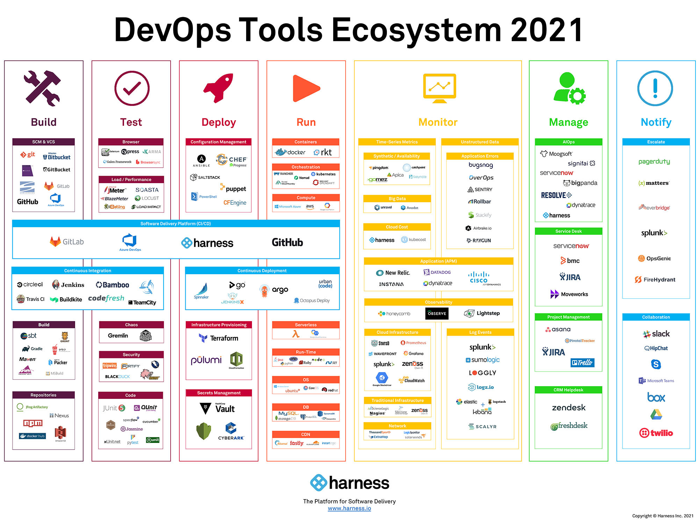
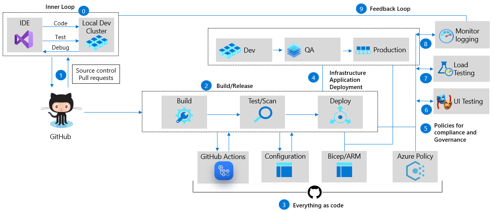
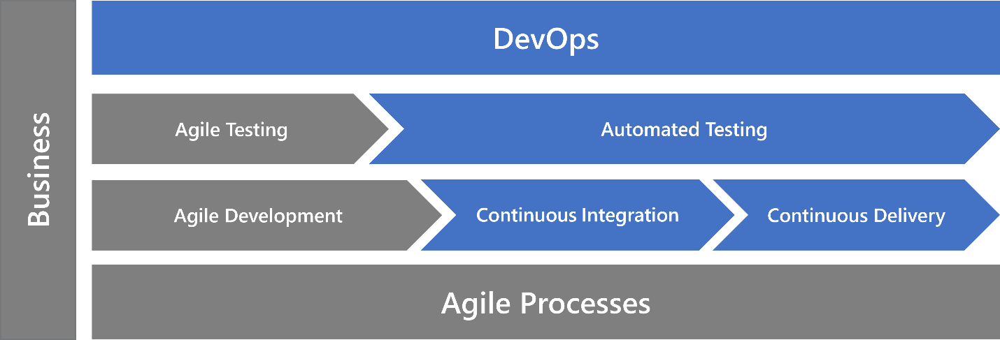

<!-- _class: 'lead' -->

# DEVOPS

## Bring better products to end user faster

---
# Agenda
1. Definition
1. Benefits
1. Application Lifecycle
1. Culture
1. Practices
1. Tools

---

<!-- _class: 'vertical-center' -->

>DevOps is the union of people, process, and products to enable continuous delivery of value to our end users.

Donovan Brown

---
<!-- _class: 'box-flex box-center' -->

# DevOps

- **PEOPLE**	

	
	
- **POCESS**

	

- **PRODUCTS**

	 

---
<!-- _class: 'box-flex  box-center' -->
# Benefits

- Accelerating time to market
- Adapting to the market and competition
- Maintaining system stability and reliability
- Improving the mean time to recovery

---
<!-- _footer: '' -->

# Application Lifecycle

DevOps influences the application lifecycle throughout its phases:

- plan 
- develop 
- deliver
- operate

In a true DevOps culture, each role is involved in each phase to some extent.

---
<!-- _class: 'box-flex box-center' -->
<!-- _footer: '' -->

# Culture

While adopting DevOps practices automates and optimizes processes through technology, it all starts with the culture inside the organization- and the people who play a part in it. The challenge of cultivating a DevOps culture requires deep changes in the way people work and collaborate.

- Collaboration, visibility, and alignment
- Shifts in scope and accountability
- Shorter release cycles
- Continuous learning

---
<!-- _class: 'box-flex box-center' -->
<!-- _footer: '' -->

# Practices

Beyond establishing a DevOps culture, teams bring DevOps to life by implementing certain practices throughout the application lifecycle. Some of these practices help accelerate, automate, and improve a specific phase. Others span several phases, helping teams create seamless processes that help improve productivity.

- Version Control
- Continuous integration and continuous delivery (CI/CD)
- Agile Software Development
- Infrastructure as Code
- Configuration Management
- Continuous Monitoring

---

  

---

  

---

  

---

# References

- [Donovan Brown Blog](http://www.donovanbrown.com/post/what-is-devops)
- [Microsoft Docs](https://azure.microsoft.com/en-gb/overview/what-is-devops/#devops-overview)
- [AWS Docs](https://aws.amazon.com/devops/what-is-devops/)
- [Learn more about Git](https://guides.github.com/introduction/git-handbook/)
- [Learn how Agile and DevOps work together](https://azure.microsoft.com/en-us/overview/devops-vs-agile/)
- [Devops Nirvana](https://devblogs.microsoft.com/premier-developer/devops-nirvana-part-1/)
