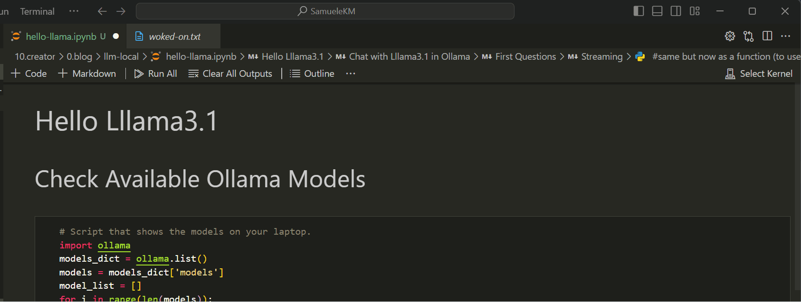

The idea of running LLMs on a personal computer is not entirely new. In fact, researchers and developers have been experimenting with this concept for several years. However, the recent advancements in computing power and software development have made it increasingly feasible to deploy these complex models on local machines.

## Stories

1. [LLM Local](../llm-local_prerequisites/index.md)
2. **[Hello Llama](index.md)**
3. [Hello LlamaIndex](../llm-local_hello-llamaIndex/index.md)
4. [Obsidian LLM](../llm-obsidian/index.md)

## VS Code iPython Notebook

Using Visual Studio Code (VS Code) with IPython notebooks creates a versatile and efficient environment for data science and programming tasks. VS Code’s built-in support for Jupyter notebooks allows users to create, edit, and run IPython notebooks directly within the editor, offering a rich coding experience with features like syntax highlighting, IntelliSense for code completion, and debugging capabilities. According to the official [VS Code documentation](https://code.visualstudio.com/docs/python/jupyter-support), these features provide a more robust experience compared to traditional Jupyter interfaces. Additionally, the ability to work within a single interface that combines notebook execution with access to version control, extensions, and terminal commands significantly enhances workflow efficiency and productivity.

To begin working with large language models (LLMs) like ollama and llamaindex on your local machine, you first need to set up a suitable Python environment. This involves configuring the necessary packages for these models in your chosen Python environment. This setup will enable you to utilize the capabilities of LLMs such as ollama and llamaindex effectively on your personal computer.



## Hello Lllama3.1

One of the most exciting parts of the notebook is the section dedicated to chatting with Llama 3.1. Using Ollama’s API, you can initiate a conversation with the model and receive responses. The notebook demonstrates how to send a question to Llama 3.1 and print the response.

Here’s a snippet from the notebook that sends a question to Llama 3.1 using Ollama’s chat functionality:

```python
import ollama
response = ollama.chat(model='llama3.1', messages=[
  {
    'role': 'user',
    'content': 'Who is Paul Graham?',
  },
])
print(response['message']['content'])
```

The response from Llama 3.1 provides a brief but informative answer to the question, showcasing the model’s ability to understand and process user queries.

For those interested in real-time interaction, the notebook also covers how to stream responses from Llama 3.1. This is particularly useful when integrating the model with user interfaces, such as those built with Gradio, where dynamic, ongoing interactions are crucial.

```python
import ollama

def ollama_chat_stream(question):
    stream = ollama.chat(
        model='llama3.1',
        messages=[{'role': 'user', 'content': question}],
        stream=True,
    )

    for chunk in stream:
        print(chunk['message']['content'], end='', flush=True)

ollama_chat_stream("Who is Paul Graham?")
```

This function sends a question to Llama 3.1 and streams the response in chunks, offering a smooth and continuous output that mimics a real conversation.


