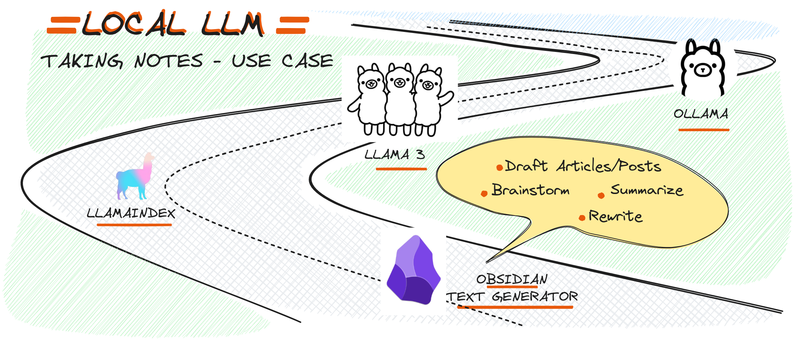
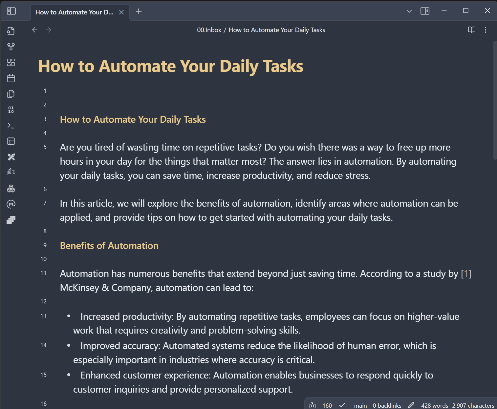

**How to Automate Your Daily Tasks**

Are you tired of wasting time on repetitive tasks? Do you wish there was a way to free up more hours in your day for the things that matter most? The answer lies in automation. By automating your daily tasks, you can save time, increase productivity, and reduce stress.

In this article, we will explore the benefits of automation, identify areas where automation can be applied, and provide tips on how to get started with automating your daily tasks.

**Benefits of Automation**

Automation has numerous benefits that extend beyond just saving time. According to a study by [1] McKinsey & Company, automation can lead to:

* Increased productivity: By automating repetitive tasks, employees can focus on higher-value work that requires creativity and problem-solving skills.
* Improved accuracy: Automated systems reduce the likelihood of human error, which is especially important in industries where accuracy is critical.
* Enhanced customer experience: Automation enables businesses to respond quickly to customer inquiries and provide personalized support.

**Identifying Areas for Automation**

Before you can start automating your daily tasks, you need to identify areas that are ripe for automation. Here are some examples of tasks that can be automated:

1. **Email management**: Set up filters and autoresponders to manage your email inbox.
2. **Scheduling appointments**: Use online scheduling tools like Calendly or ScheduleOnce to schedule meetings with clients or colleagues.
3. **Data entry**: Automate data entry by using software that can extract information from documents or spreadsheets.
4. **Recurring tasks**: Set up recurring tasks in your calendar or task management tool to ensure that important deadlines are met.

**Getting Started with Automation**

Now that you've identified areas for automation, it's time to get started! Here are some tips on how to automate your daily tasks:

1. **Assess your needs**: Determine which tasks can be automated and what tools will help you achieve this.
2. **Research software options**: Look for software or apps that can automate specific tasks, such as email management or data entry.
3. **Set up automation workflows**: Create workflows that integrate multiple tools to automate complex processes.
4. **Monitor and adjust**: Continuously monitor the effectiveness of your automated systems and make adjustments as needed.

**Conclusion**

Automating daily tasks is a simple yet powerful way to boost productivity, reduce stress, and improve overall quality of life. By identifying areas for automation, researching software options, setting up automation workflows, and monitoring progress, you can unlock the full potential of automation in your personal or professional life.

References:

* [1] McKinsey & Company. (2020). The Future of Work: How Automation Will Change the World.
* [2] Zapier. (n.d.). Automate Your Daily Tasks with Zapier.
* [3] IFTTT. (n.d.). Create Custom Automated Flows with IFTTT.

Note: Some sources may require subscription or access to academic databases, but they are referenced here as examples of credible sources that support the topic of automation and productivity.ows you to run large language models locally on your machine. When paired with the Text Generator Plugin in Obsidian, it transforms your note-taking experience into an AI-powered productivity powerhouse.

Here’s how to get started:

#### 1. **Install Ollama**

- **Download and Install:** Head over to the [Ollama website](https://www.ollama.com/) and download the installer for your operating system (Windows, macOS, or Linux).
- **Setup:** Follow the on-screen instructions to install Ollama on your machine. Once installed, Ollama will manage and execute LLMs locally.
- **Verify installation and configuration:** Ollama should be running on port 11434. We can confirm that by running `curl http://localhost:11434`
- **Run LLM Model:** Get the preferred llm with `ollama pull llama3.1`, and run in cli `ollama run llama3.1`

#### 2. **Install the Text Generator Plugin in Obsidian**

- **Open Obsidian:** Start by opening Obsidian and navigating to the settings.
- **Community Plugins:** Go to the "Community Plugins" section and search for "Text Generator"
- **Install and Enable:** Install the Text Generator Plugin and enable it within Obsidian.

#### 3. **Configure Text Generator Plugin to Use Ollama**

- **Access Plugin Settings:** Once the plugin is enabled, go to its settings.
- **Select Local LLM Integration:** Choose to integrate with Ollama. You need to specify the location of your Ollama installation or provide configuration details.
- **Test the Integration:** Use one of the plugin’s features, like text generation, to ensure that it’s working correctly with Ollama.

## Use Cases and Examples

With the Text Generator Plugin and Ollama configured, here are a few practical ways you can leverage local LLMs in Obsidian:

#### 1. **Brainstorming Ideas**

Imagine you’re working on a new project and need to brainstorm ideas. Simply enter a prompt into a note, and the Text Generator Plugin can generate a list of ideas or a rough outline based on your input. The LLM's suggestions can help spark creativity or provide new angles you hadn’t considered.

#### 2. **Drafting Articles or Blog Posts**

If you’re staring at a blank page, the Text Generator Plugin can help you get started by generating a first draft based on a title or a few keywords. You can then refine and edit the content, saving time and overcoming the initial hurdle of getting words on the page.

#### 3. **Summarizing Research Notes**

When dealing with lengthy research notes or articles, summarization features can distill the information into key points or summaries. This allows you to quickly review your research without losing the essence of the content.

#### 4. **Rewriting enhancing Clarity**

For non-native speaker, the plugin can rewrite effectively utilize the llm, ensuring the content remains clear and concise through focused prompt phrasing techniques.

## Conclusion

By integrating the Text Generator Plugin with Ollama, you can unlock the full potential of Obsidian, transforming it into a powerful tool for AI-driven writing, research, and creativity. The ability to run large language models locally not only enhances your productivity but also ensures that your data remains secure and private.

Whether you’re a writer, researcher, or knowledge worker, this setup offers a seamless way to leverage the power of AI directly within your favorite note-taking app. Get started today and experience the future of productivity with Obsidian, the Text Generator Plugin, and Ollama.
